# DocID 分位条件概率分析报告

## 核心思路

对于每个 SAE latent，当它激活时，统计 DocID 各位置取不同值的 **条件概率** P(DocID[pos]=v | latent active)。
与全局基线 P(DocID[pos]=v) 对比，用 KL 散度衡量偏离程度。
KL 散度越大，说明该 latent 的激活越偏好某些特定的 DocID 值。

## 方法

- **条件概率**: P(DocID[pos]=v | latent active) = #激活样本中该位置为v / #该latent激活总数
- **全局基线**: P(DocID[pos]=v) = #该位置为v的样本 / #有该位置的样本总数
- **区分度**: KL( P(DocID[pos]=v | active) || P(DocID[pos]=v) ) — 越大越偏离随机
- **过滤**: 仅统计激活样本数 >= 50 的 latent（共 3546/8192 个合格）

## 数据概览

- SAE 特征维度: 8192
- 样本数: 7830
- 分析位置: [0, 1, 2, 3]
- 生成柱状图数: top-500

- Position 0: 7830 个样本
- Position 1: 7830 个样本
- Position 2: 7830 个样本
- Position 3: 7290 个样本

### 全局基线分布

- Position 0: top3 [v16=0.072, v14=0.066, v11=0.055]
- Position 1: top3 [v17=0.040, v24=0.040, v4=0.037]
- Position 2: top3 [v2=0.054, v1=0.054, v3=0.048]
- Position 3: top3 [v0=0.277, v1=0.179, v2=0.122]

## Top-500 最有区分度的 Latent

| 排名 | Latent | 最佳位置 | KL散度 | Pos 0 KL | Pos 1 KL | Pos 2 KL | Pos 3 KL | 激活样本数 |
|------|--------|---------|--------|----------|----------|----------|----------|-----------|
| 1 | 3201 | 0 | 2.1123 | 2.1123 | 1.2700 | 0.3701 | 0.1584 | 60 |
| 2 | 4697 | 0 | 1.6463 | 1.6463 | 0.4696 | 0.3176 | 0.1501 | 68 |
| 3 | 6972 | 0 | 1.5541 | 1.5541 | 0.4728 | 0.1191 | 0.0744 | 169 |
| 4 | 853 | 0 | 1.4195 | 1.4195 | 0.6574 | 0.3039 | 0.2493 | 58 |
| 5 | 6420 | 0 | 1.4068 | 1.4068 | 0.2442 | 0.0625 | 0.1363 | 265 |
| 6 | 6358 | 0 | 1.4035 | 1.4035 | 0.8325 | 0.2951 | 0.2035 | 72 |
| 7 | 3155 | 0 | 1.3950 | 1.3950 | 0.7008 | 0.1122 | 0.1532 | 162 |
| 8 | 3634 | 1 | 1.3536 | 0.4297 | 1.3536 | 0.1997 | 0.1794 | 110 |
| 9 | 2474 | 0 | 1.2713 | 1.2713 | 0.2486 | 0.0558 | 0.0742 | 261 |
| 10 | 3674 | 0 | 1.2625 | 1.2625 | 0.4310 | 0.1390 | 0.1022 | 226 |
| 11 | 3336 | 0 | 1.2603 | 1.2603 | 0.6277 | 0.4228 | 0.2507 | 68 |
| 12 | 4165 | 0 | 1.2541 | 1.2541 | 0.7332 | 0.4017 | 0.3547 | 65 |
| 13 | 3407 | 0 | 1.2385 | 1.2385 | 0.2838 | 0.0519 | 0.0848 | 311 |
| 14 | 1991 | 0 | 1.2377 | 1.2377 | 0.4701 | 0.1914 | 0.1480 | 78 |
| 15 | 7760 | 0 | 1.2229 | 1.2229 | 0.1302 | 0.0623 | 0.0702 | 286 |
| 16 | 1264 | 0 | 1.2112 | 1.2112 | 0.2541 | 0.0866 | 0.0600 | 257 |
| 17 | 3872 | 0 | 1.1846 | 1.1846 | 0.1592 | 0.0548 | 0.0584 | 330 |
| 18 | 3548 | 0 | 1.1781 | 1.1781 | 0.4940 | 0.2481 | 0.2402 | 75 |
| 19 | 1477 | 0 | 1.1723 | 1.1723 | 1.0196 | 0.2937 | 0.2959 | 71 |
| 20 | 6004 | 0 | 1.1690 | 1.1690 | 0.3187 | 0.0823 | 0.0862 | 271 |
| 21 | 1992 | 0 | 1.1656 | 1.1656 | 0.8862 | 0.2683 | 0.2912 | 64 |
| 22 | 2819 | 0 | 1.1615 | 1.1615 | 0.5903 | 0.3821 | 0.1923 | 56 |
| 23 | 7556 | 0 | 1.1579 | 1.1579 | 0.3922 | 0.1485 | 0.1389 | 122 |
| 24 | 6796 | 0 | 1.1215 | 1.1215 | 0.1848 | 0.0392 | 0.0576 | 385 |
| 25 | 899 | 0 | 1.1190 | 1.1190 | 0.1309 | 0.0604 | 0.0944 | 231 |
| 26 | 70 | 0 | 1.1186 | 1.1186 | 0.1302 | 0.0531 | 0.0937 | 423 |
| 27 | 1795 | 0 | 1.1113 | 1.1113 | 0.2632 | 0.1479 | 0.2104 | 213 |
| 28 | 4875 | 0 | 1.1085 | 1.1085 | 0.1690 | 0.0621 | 0.0554 | 268 |
| 29 | 2704 | 0 | 1.1062 | 1.1062 | 0.4405 | 0.1245 | 0.0561 | 235 |
| 30 | 8182 | 0 | 1.0970 | 1.0970 | 0.1869 | 0.0994 | 0.0828 | 181 |
| 31 | 7505 | 0 | 1.0898 | 1.0898 | 0.3096 | 0.1642 | 0.1298 | 191 |
| 32 | 353 | 0 | 1.0847 | 1.0847 | 0.2569 | 0.1718 | 0.1131 | 183 |
| 33 | 5000 | 0 | 1.0830 | 1.0830 | 0.3453 | 0.0753 | 0.2264 | 164 |
| 34 | 951 | 0 | 1.0750 | 1.0750 | 0.3721 | 0.1749 | 0.2541 | 98 |
| 35 | 8123 | 0 | 1.0686 | 1.0686 | 0.2383 | 0.0823 | 0.0849 | 235 |
| 36 | 18 | 0 | 1.0619 | 1.0619 | 0.1625 | 0.0982 | 0.0861 | 229 |
| 37 | 6526 | 0 | 1.0584 | 1.0584 | 0.2820 | 0.1666 | 0.1974 | 98 |
| 38 | 5103 | 0 | 1.0570 | 1.0570 | 0.3491 | 0.0997 | 0.0770 | 252 |
| 39 | 6897 | 0 | 1.0505 | 1.0505 | 0.6010 | 0.3615 | 0.5104 | 61 |
| 40 | 4517 | 0 | 1.0441 | 1.0441 | 0.1172 | 0.1011 | 0.0780 | 285 |
| 41 | 1781 | 0 | 1.0414 | 1.0414 | 0.1968 | 0.0809 | 0.0662 | 156 |
| 42 | 5630 | 0 | 1.0289 | 1.0289 | 0.2426 | 0.1014 | 0.0899 | 267 |
| 43 | 4357 | 0 | 1.0288 | 1.0288 | 0.2512 | 0.1142 | 0.1563 | 161 |
| 44 | 3816 | 0 | 1.0213 | 1.0213 | 0.1573 | 0.0397 | 0.0482 | 615 |
| 45 | 3072 | 0 | 1.0206 | 1.0206 | 0.6119 | 0.1631 | 0.1643 | 204 |
| 46 | 5537 | 0 | 1.0154 | 1.0154 | 0.3178 | 0.1230 | 0.1150 | 215 |
| 47 | 2258 | 0 | 1.0130 | 1.0130 | 0.1216 | 0.0603 | 0.1007 | 315 |
| 48 | 4571 | 0 | 0.9980 | 0.9980 | 0.2187 | 0.0234 | 0.0767 | 404 |
| 49 | 6695 | 0 | 0.9917 | 0.9917 | 0.6179 | 0.3106 | 0.3504 | 68 |
| 50 | 7189 | 0 | 0.9915 | 0.9915 | 0.4020 | 0.2209 | 0.1545 | 165 |
| 51 | 1135 | 0 | 0.9838 | 0.9838 | 0.2054 | 0.0736 | 0.1241 | 202 |
| 52 | 2010 | 0 | 0.9785 | 0.9785 | 0.2909 | 0.0841 | 0.0593 | 292 |
| 53 | 371 | 0 | 0.9774 | 0.9774 | 0.2260 | 0.1412 | 0.1122 | 178 |
| 54 | 3854 | 0 | 0.9728 | 0.9728 | 0.2467 | 0.0638 | 0.0576 | 237 |
| 55 | 26 | 0 | 0.9685 | 0.9685 | 0.1444 | 0.0813 | 0.0731 | 324 |
| 56 | 4441 | 0 | 0.9668 | 0.9668 | 0.3658 | 0.1450 | 0.1126 | 161 |
| 57 | 1124 | 0 | 0.9652 | 0.9652 | 0.5001 | 0.3186 | 0.2812 | 58 |
| 58 | 19 | 0 | 0.9518 | 0.9518 | 0.4038 | 0.1640 | 0.0721 | 181 |
| 59 | 3055 | 0 | 0.9499 | 0.9499 | 0.1764 | 0.0547 | 0.0641 | 363 |
| 60 | 4387 | 0 | 0.9474 | 0.9474 | 0.2350 | 0.0884 | 0.0571 | 210 |
| 61 | 8124 | 0 | 0.9399 | 0.9399 | 0.2817 | 0.1632 | 0.1824 | 128 |
| 62 | 2069 | 0 | 0.9365 | 0.9365 | 0.1667 | 0.0448 | 0.0393 | 475 |
| 63 | 6946 | 0 | 0.9327 | 0.9327 | 0.2536 | 0.0883 | 0.0913 | 174 |
| 64 | 1882 | 0 | 0.9309 | 0.9309 | 0.2092 | 0.2356 | 0.2343 | 104 |
| 65 | 7148 | 0 | 0.9307 | 0.9307 | 0.2054 | 0.0974 | 0.2095 | 343 |
| 66 | 1269 | 0 | 0.9300 | 0.9300 | 0.0934 | 0.0735 | 0.0677 | 335 |
| 67 | 619 | 0 | 0.9219 | 0.9219 | 0.2404 | 0.0578 | 0.1661 | 248 |
| 68 | 1725 | 0 | 0.9212 | 0.9212 | 0.2734 | 0.4218 | 0.2020 | 89 |
| 69 | 7859 | 0 | 0.9174 | 0.9174 | 0.1635 | 0.0610 | 0.0319 | 540 |
| 70 | 1605 | 0 | 0.9166 | 0.9166 | 0.3669 | 0.1191 | 0.0761 | 188 |
| 71 | 6913 | 0 | 0.9162 | 0.9162 | 0.1293 | 0.0429 | 0.1361 | 479 |
| 72 | 6838 | 0 | 0.9137 | 0.9137 | 0.0876 | 0.1071 | 0.0627 | 234 |
| 73 | 8114 | 0 | 0.9115 | 0.9115 | 0.2062 | 0.0885 | 0.0748 | 278 |
| 74 | 4301 | 0 | 0.9099 | 0.9099 | 0.2042 | 0.0412 | 0.0541 | 413 |
| 75 | 1592 | 0 | 0.9085 | 0.9085 | 0.2248 | 0.0938 | 0.0744 | 259 |
| 76 | 2564 | 0 | 0.9063 | 0.9063 | 0.1745 | 0.1146 | 0.1010 | 235 |
| 77 | 7833 | 0 | 0.9062 | 0.9062 | 0.2274 | 0.1821 | 0.1432 | 144 |
| 78 | 2209 | 0 | 0.9045 | 0.9045 | 0.1572 | 0.0604 | 0.0751 | 337 |
| 79 | 7721 | 0 | 0.9035 | 0.9035 | 0.2830 | 0.0682 | 0.0587 | 312 |
| 80 | 2469 | 0 | 0.9003 | 0.9003 | 0.2203 | 0.1049 | 0.0548 | 308 |
| 81 | 1869 | 0 | 0.8997 | 0.8997 | 0.1752 | 0.0733 | 0.0822 | 243 |
| 82 | 2727 | 0 | 0.8970 | 0.8970 | 0.1577 | 0.0512 | 0.1691 | 349 |
| 83 | 459 | 0 | 0.8951 | 0.8951 | 0.1705 | 0.0773 | 0.0824 | 285 |
| 84 | 6075 | 0 | 0.8932 | 0.8932 | 0.2098 | 0.1473 | 0.0869 | 332 |
| 85 | 3993 | 0 | 0.8871 | 0.8871 | 0.3056 | 0.1324 | 0.0602 | 353 |
| 86 | 7651 | 0 | 0.8867 | 0.8867 | 0.2842 | 0.1756 | 0.1771 | 157 |
| 87 | 945 | 0 | 0.8866 | 0.8866 | 0.1752 | 0.0783 | 0.0780 | 277 |
| 88 | 1690 | 0 | 0.8857 | 0.8857 | 0.1364 | 0.0465 | 0.0688 | 353 |
| 89 | 1321 | 0 | 0.8838 | 0.8838 | 0.2121 | 0.1071 | 0.0691 | 365 |
| 90 | 8007 | 0 | 0.8836 | 0.8836 | 0.5560 | 0.3563 | 0.2375 | 96 |
| 91 | 877 | 0 | 0.8824 | 0.8824 | 0.2223 | 0.1075 | 0.0648 | 384 |
| 92 | 0 | 0 | 0.8816 | 0.8816 | 0.2910 | 0.0795 | 0.0681 | 255 |
| 93 | 4843 | 0 | 0.8784 | 0.8784 | 0.1559 | 0.0659 | 0.1214 | 302 |
| 94 | 1746 | 0 | 0.8739 | 0.8739 | 0.2469 | 0.1177 | 0.0797 | 153 |
| 95 | 2711 | 0 | 0.8718 | 0.8718 | 0.2937 | 0.0661 | 0.0605 | 265 |
| 96 | 5444 | 0 | 0.8707 | 0.8707 | 0.3377 | 0.1557 | 0.1115 | 140 |
| 97 | 6788 | 0 | 0.8686 | 0.8686 | 0.6009 | 0.1984 | 0.0900 | 176 |
| 98 | 375 | 0 | 0.8681 | 0.8681 | 0.2907 | 0.1010 | 0.1339 | 242 |
| 99 | 5995 | 0 | 0.8645 | 0.8645 | 0.5724 | 0.2874 | 0.2595 | 51 |
| 100 | 6880 | 0 | 0.8618 | 0.8618 | 0.3206 | 0.0843 | 0.1072 | 201 |
| 101 | 6623 | 0 | 0.8607 | 0.8607 | 0.1771 | 0.0554 | 0.0626 | 418 |
| 102 | 2879 | 0 | 0.8603 | 0.8603 | 0.2145 | 0.0590 | 0.1501 | 301 |
| 103 | 7375 | 0 | 0.8601 | 0.8601 | 0.1358 | 0.0678 | 0.1005 | 478 |
| 104 | 4359 | 0 | 0.8595 | 0.8595 | 0.2409 | 0.1062 | 0.0831 | 209 |
| 105 | 2547 | 0 | 0.8594 | 0.8594 | 0.2125 | 0.0599 | 0.0842 | 300 |
| 106 | 5124 | 0 | 0.8489 | 0.8489 | 0.1560 | 0.0486 | 0.1111 | 541 |
| 107 | 5814 | 0 | 0.8453 | 0.8453 | 0.1452 | 0.0991 | 0.1834 | 241 |
| 108 | 5005 | 0 | 0.8444 | 0.8444 | 0.2612 | 0.0688 | 0.0700 | 250 |
| 109 | 3731 | 0 | 0.8431 | 0.8431 | 0.1163 | 0.0483 | 0.0458 | 436 |
| 110 | 55 | 0 | 0.8428 | 0.8428 | 0.4906 | 0.2020 | 0.1771 | 149 |
| 111 | 1444 | 0 | 0.8407 | 0.8407 | 0.1872 | 0.1096 | 0.2194 | 282 |
| 112 | 2224 | 0 | 0.8403 | 0.8403 | 0.3504 | 0.1346 | 0.1426 | 222 |
| 113 | 5095 | 0 | 0.8399 | 0.8399 | 0.3081 | 0.0676 | 0.0502 | 363 |
| 114 | 724 | 0 | 0.8391 | 0.8391 | 0.1455 | 0.0519 | 0.0902 | 363 |
| 115 | 7580 | 0 | 0.8359 | 0.8359 | 0.5004 | 0.4031 | 0.2457 | 52 |
| 116 | 6929 | 0 | 0.8352 | 0.8352 | 0.2545 | 0.1049 | 0.0568 | 265 |
| 117 | 2614 | 0 | 0.8343 | 0.8343 | 0.1678 | 0.0567 | 0.0434 | 302 |
| 118 | 5707 | 0 | 0.8313 | 0.8313 | 0.2046 | 0.0428 | 0.0765 | 399 |
| 119 | 7561 | 0 | 0.8309 | 0.8309 | 0.1457 | 0.0679 | 0.0861 | 242 |
| 120 | 4519 | 0 | 0.8298 | 0.8298 | 0.2640 | 0.1547 | 0.1068 | 189 |
| 121 | 2236 | 0 | 0.8291 | 0.8291 | 0.1491 | 0.1175 | 0.0684 | 283 |
| 122 | 5205 | 0 | 0.8285 | 0.8285 | 0.2182 | 0.0432 | 0.0973 | 334 |
| 123 | 7016 | 0 | 0.8282 | 0.8282 | 0.1790 | 0.0999 | 0.0941 | 207 |
| 124 | 363 | 0 | 0.8279 | 0.8279 | 0.2429 | 0.0813 | 0.1322 | 251 |
| 125 | 5278 | 0 | 0.8278 | 0.8278 | 0.5221 | 0.3869 | 0.1448 | 56 |
| 126 | 213 | 0 | 0.8271 | 0.8271 | 0.2115 | 0.0818 | 0.1024 | 253 |
| 127 | 3596 | 0 | 0.8266 | 0.8266 | 0.2370 | 0.0729 | 0.0732 | 293 |
| 128 | 5309 | 0 | 0.8228 | 0.8228 | 0.1536 | 0.1057 | 0.0645 | 186 |
| 129 | 3607 | 0 | 0.8227 | 0.8227 | 0.2123 | 0.0881 | 0.1399 | 268 |
| 130 | 3151 | 0 | 0.8221 | 0.8221 | 0.0926 | 0.0582 | 0.0903 | 510 |
| 131 | 815 | 0 | 0.8187 | 0.8187 | 0.1015 | 0.0332 | 0.0307 | 526 |
| 132 | 5887 | 0 | 0.8184 | 0.8184 | 0.1981 | 0.1273 | 0.1295 | 288 |
| 133 | 1921 | 1 | 0.8175 | 0.7384 | 0.8175 | 0.3119 | 0.1372 | 74 |
| 134 | 3136 | 0 | 0.8168 | 0.8168 | 0.1482 | 0.0469 | 0.0585 | 307 |
| 135 | 1066 | 0 | 0.8165 | 0.8165 | 0.1582 | 0.0416 | 0.0783 | 620 |
| 136 | 4064 | 0 | 0.8147 | 0.8147 | 0.1728 | 0.0481 | 0.0973 | 208 |
| 137 | 5714 | 0 | 0.8121 | 0.8121 | 0.2751 | 0.1021 | 0.1035 | 254 |
| 138 | 6728 | 0 | 0.8116 | 0.8116 | 0.2543 | 0.0821 | 0.0689 | 252 |
| 139 | 6221 | 0 | 0.8098 | 0.8098 | 0.1659 | 0.0675 | 0.0530 | 345 |
| 140 | 2307 | 0 | 0.8089 | 0.8089 | 0.1440 | 0.1140 | 0.0903 | 284 |
| 141 | 7687 | 0 | 0.8089 | 0.8089 | 0.1960 | 0.0713 | 0.0549 | 387 |
| 142 | 2809 | 0 | 0.8087 | 0.8087 | 0.1204 | 0.0307 | 0.0428 | 395 |
| 143 | 7252 | 0 | 0.8076 | 0.8076 | 0.1703 | 0.0567 | 0.1203 | 294 |
| 144 | 6595 | 0 | 0.8032 | 0.8032 | 0.3393 | 0.1158 | 0.0573 | 257 |
| 145 | 4071 | 0 | 0.7969 | 0.7969 | 0.1976 | 0.0639 | 0.1119 | 218 |
| 146 | 1213 | 0 | 0.7966 | 0.7966 | 0.1598 | 0.0575 | 0.0634 | 270 |
| 147 | 6588 | 0 | 0.7952 | 0.7952 | 0.2123 | 0.0640 | 0.0624 | 379 |
| 148 | 5608 | 0 | 0.7935 | 0.7935 | 0.1554 | 0.1428 | 0.2214 | 166 |
| 149 | 2418 | 1 | 0.7932 | 0.7602 | 0.7932 | 0.1930 | 0.1802 | 109 |
| 150 | 7191 | 0 | 0.7931 | 0.7931 | 0.1281 | 0.0502 | 0.0610 | 297 |
| 151 | 3678 | 0 | 0.7930 | 0.7930 | 0.2057 | 0.0982 | 0.0710 | 292 |
| 152 | 3661 | 0 | 0.7927 | 0.7927 | 0.1650 | 0.0637 | 0.0428 | 382 |
| 153 | 2231 | 0 | 0.7924 | 0.7924 | 0.1683 | 0.0424 | 0.0645 | 440 |
| 154 | 3124 | 0 | 0.7921 | 0.7921 | 0.5085 | 0.1053 | 0.1182 | 157 |
| 155 | 2796 | 0 | 0.7907 | 0.7907 | 0.6864 | 0.5211 | 0.1984 | 53 |
| 156 | 7530 | 0 | 0.7905 | 0.7905 | 0.0314 | 0.0231 | 0.0186 | 568 |
| 157 | 6957 | 0 | 0.7905 | 0.7905 | 0.2340 | 0.0777 | 0.0574 | 260 |
| 158 | 948 | 0 | 0.7895 | 0.7895 | 0.2518 | 0.0615 | 0.2493 | 160 |
| 159 | 3966 | 0 | 0.7892 | 0.7892 | 0.4575 | 0.1829 | 0.1761 | 73 |
| 160 | 8157 | 0 | 0.7870 | 0.7870 | 0.2384 | 0.1766 | 0.1448 | 163 |
| 161 | 191 | 0 | 0.7864 | 0.7864 | 0.4646 | 0.2291 | 0.0713 | 127 |
| 162 | 4152 | 0 | 0.7859 | 0.7859 | 0.4054 | 0.2023 | 0.1187 | 126 |
| 163 | 1380 | 0 | 0.7855 | 0.7855 | 0.3002 | 0.1127 | 0.1310 | 160 |
| 164 | 2612 | 0 | 0.7846 | 0.7846 | 0.1841 | 0.0964 | 0.0691 | 227 |
| 165 | 6212 | 0 | 0.7832 | 0.7832 | 0.2063 | 0.0844 | 0.1168 | 192 |
| 166 | 2281 | 0 | 0.7830 | 0.7830 | 0.1993 | 0.1167 | 0.0543 | 228 |
| 167 | 1441 | 0 | 0.7828 | 0.7828 | 0.1982 | 0.0914 | 0.0575 | 230 |
| 168 | 1975 | 0 | 0.7789 | 0.7789 | 0.1711 | 0.0880 | 0.0669 | 455 |
| 169 | 3643 | 0 | 0.7787 | 0.7787 | 0.2592 | 0.1334 | 0.1571 | 162 |
| 170 | 2621 | 0 | 0.7778 | 0.7778 | 0.3603 | 0.0697 | 0.0435 | 231 |
| 171 | 283 | 0 | 0.7777 | 0.7777 | 0.2052 | 0.0612 | 0.0571 | 400 |
| 172 | 6053 | 0 | 0.7775 | 0.7775 | 0.1969 | 0.0427 | 0.0429 | 400 |
| 173 | 6193 | 0 | 0.7771 | 0.7771 | 0.3623 | 0.3396 | 0.1429 | 125 |
| 174 | 1428 | 0 | 0.7747 | 0.7747 | 0.2129 | 0.0762 | 0.0465 | 421 |
| 175 | 3783 | 0 | 0.7746 | 0.7746 | 0.3722 | 0.1979 | 0.1133 | 220 |
| 176 | 5296 | 0 | 0.7705 | 0.7705 | 0.2311 | 0.0943 | 0.0537 | 306 |
| 177 | 6966 | 0 | 0.7690 | 0.7690 | 0.1430 | 0.0551 | 0.0413 | 294 |
| 178 | 287 | 0 | 0.7684 | 0.7684 | 0.2518 | 0.0384 | 0.1085 | 346 |
| 179 | 1337 | 0 | 0.7673 | 0.7673 | 0.4261 | 0.1342 | 0.1231 | 132 |
| 180 | 1717 | 0 | 0.7656 | 0.7656 | 0.1334 | 0.0645 | 0.1443 | 366 |
| 181 | 1799 | 0 | 0.7653 | 0.7653 | 0.1462 | 0.0675 | 0.0617 | 288 |
| 182 | 4445 | 0 | 0.7653 | 0.7653 | 0.1087 | 0.0265 | 0.0424 | 438 |
| 183 | 1127 | 0 | 0.7648 | 0.7648 | 0.0953 | 0.0725 | 0.0345 | 357 |
| 184 | 4713 | 0 | 0.7643 | 0.7643 | 0.2036 | 0.0607 | 0.0423 | 598 |
| 185 | 4274 | 0 | 0.7639 | 0.7639 | 0.1875 | 0.0378 | 0.0261 | 450 |
| 186 | 7488 | 0 | 0.7608 | 0.7608 | 0.1451 | 0.0907 | 0.0950 | 319 |
| 187 | 6658 | 0 | 0.7602 | 0.7602 | 0.1855 | 0.0536 | 0.0670 | 361 |
| 188 | 6569 | 0 | 0.7568 | 0.7568 | 0.1825 | 0.1224 | 0.0803 | 224 |
| 189 | 2342 | 0 | 0.7560 | 0.7560 | 0.2456 | 0.0914 | 0.1960 | 285 |
| 190 | 5903 | 0 | 0.7553 | 0.7553 | 0.2217 | 0.0830 | 0.0862 | 233 |
| 191 | 3358 | 0 | 0.7538 | 0.7538 | 0.1737 | 0.0404 | 0.0749 | 357 |
| 192 | 7972 | 0 | 0.7531 | 0.7531 | 0.1203 | 0.1071 | 0.0817 | 164 |
| 193 | 3098 | 0 | 0.7526 | 0.7526 | 0.1631 | 0.0981 | 0.0417 | 317 |
| 194 | 7087 | 0 | 0.7520 | 0.7520 | 0.1387 | 0.1025 | 0.1024 | 282 |
| 195 | 3091 | 0 | 0.7504 | 0.7504 | 0.1605 | 0.1196 | 0.1180 | 299 |
| 196 | 2758 | 0 | 0.7499 | 0.7499 | 0.2711 | 0.1075 | 0.1070 | 199 |
| 197 | 5147 | 0 | 0.7483 | 0.7483 | 0.2491 | 0.0964 | 0.1197 | 359 |
| 198 | 6286 | 0 | 0.7477 | 0.7477 | 0.1894 | 0.0522 | 0.1204 | 258 |
| 199 | 6985 | 0 | 0.7467 | 0.7467 | 0.2197 | 0.0845 | 0.0813 | 174 |
| 200 | 4386 | 0 | 0.7462 | 0.7462 | 0.3963 | 0.1896 | 0.1024 | 155 |
| 201 | 2065 | 0 | 0.7448 | 0.7448 | 0.2752 | 0.1013 | 0.1080 | 186 |
| 202 | 5300 | 0 | 0.7423 | 0.7423 | 0.2395 | 0.1088 | 0.1295 | 294 |
| 203 | 7559 | 0 | 0.7419 | 0.7419 | 0.0765 | 0.0233 | 0.0625 | 575 |
| 204 | 1594 | 0 | 0.7403 | 0.7403 | 0.1594 | 0.0778 | 0.1248 | 236 |
| 205 | 4419 | 0 | 0.7373 | 0.7373 | 0.1913 | 0.1080 | 0.1287 | 125 |
| 206 | 7727 | 0 | 0.7372 | 0.7372 | 0.1319 | 0.1012 | 0.0428 | 364 |
| 207 | 4154 | 0 | 0.7362 | 0.7362 | 0.1770 | 0.0593 | 0.0640 | 276 |
| 208 | 7266 | 0 | 0.7360 | 0.7360 | 0.1953 | 0.1083 | 0.1626 | 153 |
| 209 | 1990 | 0 | 0.7353 | 0.7353 | 0.3640 | 0.0822 | 0.0853 | 273 |
| 210 | 998 | 0 | 0.7352 | 0.7352 | 0.3067 | 0.1970 | 0.1631 | 173 |
| 211 | 293 | 0 | 0.7343 | 0.7343 | 0.1992 | 0.0785 | 0.0601 | 322 |
| 212 | 1147 | 0 | 0.7334 | 0.7334 | 0.2378 | 0.0956 | 0.1061 | 258 |
| 213 | 1728 | 0 | 0.7303 | 0.7303 | 0.1396 | 0.0839 | 0.0507 | 442 |
| 214 | 3013 | 0 | 0.7300 | 0.7300 | 0.1839 | 0.1165 | 0.0947 | 341 |
| 215 | 2113 | 0 | 0.7287 | 0.7287 | 0.1584 | 0.0884 | 0.0659 | 250 |
| 216 | 2128 | 0 | 0.7280 | 0.7280 | 0.2234 | 0.0436 | 0.0637 | 408 |
| 217 | 7172 | 0 | 0.7279 | 0.7279 | 0.1740 | 0.0486 | 0.0599 | 348 |
| 218 | 4378 | 1 | 0.7273 | 0.6123 | 0.7273 | 0.3585 | 0.2535 | 68 |
| 219 | 7520 | 0 | 0.7271 | 0.7271 | 0.1814 | 0.0621 | 0.0842 | 451 |
| 220 | 5628 | 0 | 0.7263 | 0.7263 | 0.3350 | 0.1192 | 0.1054 | 223 |
| 221 | 1261 | 0 | 0.7255 | 0.7255 | 0.3562 | 0.0489 | 0.0798 | 208 |
| 222 | 3120 | 0 | 0.7254 | 0.7254 | 0.3790 | 0.0984 | 0.0699 | 256 |
| 223 | 4497 | 0 | 0.7246 | 0.7246 | 0.2857 | 0.0737 | 0.0536 | 351 |
| 224 | 3569 | 0 | 0.7245 | 0.7245 | 0.0893 | 0.0577 | 0.0443 | 390 |
| 225 | 5018 | 0 | 0.7241 | 0.7241 | 0.1132 | 0.0425 | 0.0641 | 368 |
| 226 | 472 | 0 | 0.7240 | 0.7240 | 0.5478 | 0.1953 | 0.0939 | 141 |
| 227 | 3125 | 0 | 0.7235 | 0.7235 | 0.2909 | 0.2212 | 0.1250 | 162 |
| 228 | 7568 | 0 | 0.7229 | 0.7229 | 0.0442 | 0.0192 | 0.0220 | 937 |
| 229 | 7873 | 0 | 0.7226 | 0.7226 | 0.1249 | 0.0349 | 0.0412 | 388 |
| 230 | 6391 | 0 | 0.7215 | 0.7215 | 0.3740 | 0.1348 | 0.1107 | 112 |
| 231 | 7694 | 0 | 0.7209 | 0.7209 | 0.1901 | 0.0960 | 0.0710 | 310 |
| 232 | 3806 | 0 | 0.7207 | 0.7207 | 0.0808 | 0.0302 | 0.0473 | 425 |
| 233 | 2916 | 0 | 0.7200 | 0.7200 | 0.1939 | 0.0630 | 0.0393 | 659 |
| 234 | 5308 | 0 | 0.7198 | 0.7198 | 0.1573 | 0.0654 | 0.0737 | 331 |
| 235 | 1404 | 0 | 0.7198 | 0.7198 | 0.3019 | 0.1280 | 0.1269 | 158 |
| 236 | 4585 | 0 | 0.7187 | 0.7187 | 0.1651 | 0.0394 | 0.1204 | 423 |
| 237 | 6278 | 0 | 0.7175 | 0.7175 | 0.2850 | 0.1239 | 0.1816 | 283 |
| 238 | 4495 | 0 | 0.7169 | 0.7169 | 0.3058 | 0.1695 | 0.1313 | 182 |
| 239 | 4187 | 0 | 0.7162 | 0.7162 | 0.2237 | 0.0471 | 0.1167 | 350 |
| 240 | 7828 | 0 | 0.7155 | 0.7155 | 0.3159 | 0.0631 | 0.1249 | 322 |
| 241 | 1437 | 0 | 0.7147 | 0.7147 | 0.0930 | 0.0632 | 0.1681 | 409 |
| 242 | 7414 | 0 | 0.7136 | 0.7136 | 0.1998 | 0.0703 | 0.0656 | 323 |
| 243 | 2006 | 0 | 0.7134 | 0.7134 | 0.1470 | 0.1368 | 0.0824 | 209 |
| 244 | 2800 | 0 | 0.7130 | 0.7130 | 0.1641 | 0.0522 | 0.0620 | 382 |
| 245 | 5065 | 0 | 0.7125 | 0.7125 | 0.1659 | 0.0707 | 0.0613 | 334 |
| 246 | 6191 | 0 | 0.7123 | 0.7123 | 0.1203 | 0.0363 | 0.0503 | 718 |
| 247 | 4670 | 0 | 0.7099 | 0.7099 | 0.2562 | 0.0654 | 0.1121 | 353 |
| 248 | 999 | 0 | 0.7096 | 0.7096 | 0.1128 | 0.0533 | 0.0635 | 430 |
| 249 | 5455 | 0 | 0.7087 | 0.7087 | 0.3016 | 0.2112 | 0.1257 | 174 |
| 250 | 1300 | 0 | 0.7082 | 0.7082 | 0.1729 | 0.0469 | 0.0797 | 337 |
| 251 | 3163 | 0 | 0.7078 | 0.7078 | 0.3838 | 0.1884 | 0.1411 | 131 |
| 252 | 1681 | 0 | 0.7072 | 0.7072 | 0.2769 | 0.1326 | 0.1075 | 236 |
| 253 | 991 | 0 | 0.7059 | 0.7059 | 0.1101 | 0.0486 | 0.0560 | 424 |
| 254 | 3941 | 0 | 0.7051 | 0.7051 | 0.1804 | 0.1515 | 0.2362 | 204 |
| 255 | 2568 | 0 | 0.7041 | 0.7041 | 0.1155 | 0.0521 | 0.0459 | 360 |
| 256 | 5059 | 0 | 0.7036 | 0.7036 | 0.2733 | 0.1850 | 0.0633 | 224 |
| 257 | 2664 | 0 | 0.7035 | 0.7035 | 0.1974 | 0.0684 | 0.0533 | 349 |
| 258 | 7733 | 0 | 0.7031 | 0.7031 | 0.4487 | 0.1458 | 0.2259 | 106 |
| 259 | 7272 | 0 | 0.7023 | 0.7023 | 0.2086 | 0.0642 | 0.1044 | 398 |
| 260 | 5922 | 1 | 0.7020 | 0.4345 | 0.7020 | 0.0895 | 0.0511 | 252 |
| 261 | 622 | 0 | 0.7019 | 0.7019 | 0.2137 | 0.0858 | 0.0734 | 318 |
| 262 | 789 | 0 | 0.7015 | 0.7015 | 0.2101 | 0.1181 | 0.1261 | 204 |
| 263 | 6313 | 0 | 0.7013 | 0.7013 | 0.2890 | 0.1172 | 0.1011 | 226 |
| 264 | 1181 | 0 | 0.7007 | 0.7007 | 0.1093 | 0.0518 | 0.0351 | 369 |
| 265 | 5332 | 0 | 0.6995 | 0.6995 | 0.2588 | 0.0909 | 0.1260 | 223 |
| 266 | 4725 | 0 | 0.6994 | 0.6994 | 0.4048 | 0.1451 | 0.0633 | 237 |
| 267 | 1482 | 0 | 0.6991 | 0.6991 | 0.2405 | 0.0841 | 0.0673 | 198 |
| 268 | 2198 | 0 | 0.6988 | 0.6988 | 0.0604 | 0.0299 | 0.0596 | 537 |
| 269 | 5854 | 0 | 0.6979 | 0.6979 | 0.2278 | 0.1061 | 0.0987 | 217 |
| 270 | 6940 | 0 | 0.6970 | 0.6970 | 0.2721 | 0.0593 | 0.0367 | 329 |
| 271 | 3179 | 0 | 0.6961 | 0.6961 | 0.2105 | 0.0606 | 0.0895 | 501 |
| 272 | 7242 | 0 | 0.6947 | 0.6947 | 0.3512 | 0.1410 | 0.1263 | 153 |
| 273 | 5711 | 0 | 0.6947 | 0.6947 | 0.2755 | 0.1545 | 0.2016 | 199 |
| 274 | 1221 | 0 | 0.6944 | 0.6944 | 0.2537 | 0.1213 | 0.0910 | 221 |
| 275 | 7075 | 0 | 0.6942 | 0.6942 | 0.1187 | 0.0654 | 0.0504 | 471 |
| 276 | 2725 | 0 | 0.6933 | 0.6933 | 0.1997 | 0.0780 | 0.0782 | 300 |
| 277 | 573 | 0 | 0.6926 | 0.6926 | 0.2685 | 0.1222 | 0.0721 | 187 |
| 278 | 1009 | 0 | 0.6919 | 0.6919 | 0.4057 | 0.1130 | 0.0825 | 208 |
| 279 | 3963 | 0 | 0.6917 | 0.6917 | 0.0949 | 0.0187 | 0.0421 | 701 |
| 280 | 1636 | 0 | 0.6912 | 0.6912 | 0.0793 | 0.0547 | 0.1115 | 448 |
| 281 | 7355 | 0 | 0.6897 | 0.6897 | 0.4225 | 0.1488 | 0.0665 | 283 |
| 282 | 1111 | 0 | 0.6891 | 0.6891 | 0.1934 | 0.0446 | 0.0570 | 403 |
| 283 | 4136 | 0 | 0.6888 | 0.6888 | 0.1591 | 0.0299 | 0.0530 | 452 |
| 284 | 879 | 1 | 0.6864 | 0.3389 | 0.6864 | 0.1270 | 0.1060 | 175 |
| 285 | 3804 | 0 | 0.6855 | 0.6855 | 0.4576 | 0.1940 | 0.1384 | 163 |
| 286 | 7744 | 0 | 0.6855 | 0.6855 | 0.1775 | 0.0569 | 0.0573 | 403 |
| 287 | 4862 | 0 | 0.6853 | 0.6853 | 0.2065 | 0.1550 | 0.0711 | 181 |
| 288 | 4965 | 0 | 0.6848 | 0.6848 | 0.1116 | 0.1069 | 0.0670 | 258 |
| 289 | 2730 | 0 | 0.6847 | 0.6847 | 0.1473 | 0.0738 | 0.0368 | 443 |
| 290 | 7122 | 0 | 0.6831 | 0.6831 | 0.1274 | 0.0913 | 0.0729 | 308 |
| 291 | 6468 | 0 | 0.6824 | 0.6824 | 0.6537 | 0.2101 | 0.0818 | 187 |
| 292 | 663 | 0 | 0.6821 | 0.6821 | 0.0997 | 0.0610 | 0.0495 | 383 |
| 293 | 610 | 0 | 0.6815 | 0.6815 | 0.0640 | 0.0208 | 0.0596 | 574 |
| 294 | 7066 | 0 | 0.6814 | 0.6814 | 0.2986 | 0.0925 | 0.1685 | 356 |
| 295 | 2385 | 0 | 0.6809 | 0.6809 | 0.2971 | 0.1316 | 0.1098 | 273 |
| 296 | 215 | 0 | 0.6794 | 0.6794 | 0.2951 | 0.0809 | 0.0965 | 226 |
| 297 | 6230 | 0 | 0.6793 | 0.6793 | 0.4639 | 0.2266 | 0.0746 | 188 |
| 298 | 5545 | 0 | 0.6785 | 0.6785 | 0.1506 | 0.0290 | 0.0527 | 680 |
| 299 | 5415 | 0 | 0.6783 | 0.6783 | 0.5574 | 0.2596 | 0.2546 | 88 |
| 300 | 1909 | 0 | 0.6778 | 0.6778 | 0.0788 | 0.0270 | 0.0409 | 641 |
| 301 | 7306 | 0 | 0.6776 | 0.6776 | 0.2638 | 0.0415 | 0.0550 | 400 |
| 302 | 561 | 0 | 0.6766 | 0.6766 | 0.2126 | 0.0566 | 0.0696 | 355 |
| 303 | 5867 | 0 | 0.6754 | 0.6754 | 0.2826 | 0.1398 | 0.1171 | 151 |
| 304 | 4196 | 0 | 0.6746 | 0.6746 | 0.2137 | 0.0794 | 0.1334 | 311 |
| 305 | 3442 | 0 | 0.6745 | 0.6745 | 0.2847 | 0.1834 | 0.0909 | 137 |
| 306 | 4418 | 0 | 0.6741 | 0.6741 | 0.2888 | 0.0744 | 0.0406 | 292 |
| 307 | 2190 | 0 | 0.6733 | 0.6733 | 0.1636 | 0.0401 | 0.0491 | 432 |
| 308 | 2817 | 0 | 0.6731 | 0.6731 | 0.1493 | 0.1067 | 0.0711 | 333 |
| 309 | 1208 | 0 | 0.6720 | 0.6720 | 0.3478 | 0.2248 | 0.2821 | 120 |
| 310 | 77 | 0 | 0.6715 | 0.6715 | 0.3014 | 0.1173 | 0.1059 | 147 |
| 311 | 782 | 0 | 0.6699 | 0.6699 | 0.1686 | 0.0929 | 0.1003 | 236 |
| 312 | 5096 | 0 | 0.6699 | 0.6699 | 0.4720 | 0.2184 | 0.1038 | 145 |
| 313 | 2693 | 0 | 0.6697 | 0.6697 | 0.3398 | 0.1223 | 0.0731 | 133 |
| 314 | 2653 | 0 | 0.6689 | 0.6689 | 0.1447 | 0.1111 | 0.0776 | 190 |
| 315 | 5581 | 0 | 0.6686 | 0.6686 | 0.2341 | 0.1149 | 0.0696 | 170 |
| 316 | 3525 | 0 | 0.6677 | 0.6677 | 0.1734 | 0.0696 | 0.0456 | 398 |
| 317 | 5710 | 0 | 0.6672 | 0.6672 | 0.1551 | 0.0525 | 0.0462 | 515 |
| 318 | 1778 | 0 | 0.6662 | 0.6662 | 0.2142 | 0.1126 | 0.0656 | 211 |
| 319 | 7783 | 0 | 0.6662 | 0.6662 | 0.4115 | 0.1405 | 0.1183 | 198 |
| 320 | 6809 | 0 | 0.6662 | 0.6662 | 0.3053 | 0.1559 | 0.1575 | 199 |
| 321 | 2125 | 0 | 0.6661 | 0.6661 | 0.1112 | 0.0383 | 0.0861 | 494 |
| 322 | 4036 | 0 | 0.6653 | 0.6653 | 0.2445 | 0.1845 | 0.0711 | 206 |
| 323 | 8172 | 0 | 0.6650 | 0.6650 | 0.1525 | 0.0817 | 0.0785 | 268 |
| 324 | 5789 | 0 | 0.6644 | 0.6644 | 0.2211 | 0.0479 | 0.0429 | 290 |
| 325 | 3837 | 0 | 0.6643 | 0.6643 | 0.1774 | 0.0598 | 0.0543 | 333 |
| 326 | 509 | 0 | 0.6638 | 0.6638 | 0.2584 | 0.0826 | 0.1112 | 313 |
| 327 | 6795 | 0 | 0.6632 | 0.6632 | 0.1650 | 0.0839 | 0.0653 | 423 |
| 328 | 811 | 0 | 0.6632 | 0.6632 | 0.1502 | 0.0316 | 0.0241 | 448 |
| 329 | 7262 | 0 | 0.6625 | 0.6625 | 0.2093 | 0.0977 | 0.1020 | 227 |
| 330 | 858 | 0 | 0.6625 | 0.6625 | 0.3479 | 0.0797 | 0.0986 | 145 |
| 331 | 4996 | 0 | 0.6619 | 0.6619 | 0.1030 | 0.0626 | 0.0500 | 273 |
| 332 | 3599 | 0 | 0.6615 | 0.6615 | 0.1958 | 0.0890 | 0.1770 | 250 |
| 333 | 5760 | 0 | 0.6614 | 0.6614 | 0.1010 | 0.0790 | 0.0746 | 263 |
| 334 | 3912 | 0 | 0.6611 | 0.6611 | 0.4211 | 0.2935 | 0.2506 | 74 |
| 335 | 2243 | 0 | 0.6611 | 0.6611 | 0.2669 | 0.0605 | 0.0448 | 509 |
| 336 | 6659 | 0 | 0.6610 | 0.6610 | 0.2647 | 0.1215 | 0.1276 | 180 |
| 337 | 434 | 0 | 0.6608 | 0.6608 | 0.0501 | 0.0394 | 0.0286 | 531 |
| 338 | 4133 | 0 | 0.6607 | 0.6607 | 0.0900 | 0.0474 | 0.0578 | 448 |
| 339 | 3667 | 0 | 0.6606 | 0.6606 | 0.2585 | 0.0757 | 0.1269 | 185 |
| 340 | 4014 | 0 | 0.6604 | 0.6604 | 0.3046 | 0.1139 | 0.1258 | 194 |
| 341 | 405 | 0 | 0.6604 | 0.6604 | 0.2022 | 0.0590 | 0.0471 | 329 |
| 342 | 1659 | 0 | 0.6602 | 0.6602 | 0.1647 | 0.0377 | 0.0490 | 419 |
| 343 | 4754 | 0 | 0.6600 | 0.6600 | 0.1510 | 0.0756 | 0.0581 | 373 |
| 344 | 3714 | 0 | 0.6599 | 0.6599 | 0.1286 | 0.0503 | 0.0603 | 259 |
| 345 | 4000 | 0 | 0.6587 | 0.6587 | 0.0776 | 0.0428 | 0.0262 | 601 |
| 346 | 2271 | 0 | 0.6575 | 0.6575 | 0.1632 | 0.0404 | 0.0553 | 330 |
| 347 | 1052 | 0 | 0.6575 | 0.6575 | 0.1967 | 0.1289 | 0.1816 | 169 |
| 348 | 2822 | 0 | 0.6575 | 0.6575 | 0.1347 | 0.0878 | 0.0714 | 359 |
| 349 | 3018 | 0 | 0.6569 | 0.6569 | 0.1382 | 0.0619 | 0.0617 | 257 |
| 350 | 7288 | 0 | 0.6562 | 0.6562 | 0.4987 | 0.2641 | 0.1278 | 144 |
| 351 | 1782 | 0 | 0.6558 | 0.6558 | 0.2712 | 0.1076 | 0.2085 | 238 |
| 352 | 5910 | 0 | 0.6556 | 0.6556 | 0.4008 | 0.1408 | 0.1124 | 177 |
| 353 | 4013 | 0 | 0.6544 | 0.6544 | 0.2850 | 0.1499 | 0.0948 | 290 |
| 354 | 5645 | 0 | 0.6531 | 0.6531 | 0.1698 | 0.0744 | 0.0926 | 345 |
| 355 | 2576 | 0 | 0.6529 | 0.6529 | 0.1991 | 0.1122 | 0.0519 | 309 |
| 356 | 3654 | 0 | 0.6500 | 0.6500 | 0.3270 | 0.0988 | 0.0707 | 342 |
| 357 | 730 | 0 | 0.6493 | 0.6493 | 0.2285 | 0.0638 | 0.0574 | 380 |
| 358 | 7677 | 0 | 0.6486 | 0.6486 | 0.1952 | 0.1054 | 0.1445 | 209 |
| 359 | 7517 | 0 | 0.6485 | 0.6485 | 0.1629 | 0.0912 | 0.1014 | 287 |
| 360 | 2371 | 0 | 0.6481 | 0.6481 | 0.2036 | 0.0662 | 0.1174 | 200 |
| 361 | 6347 | 0 | 0.6481 | 0.6481 | 0.0876 | 0.0836 | 0.0948 | 474 |
| 362 | 3932 | 0 | 0.6480 | 0.6480 | 0.2293 | 0.1307 | 0.0560 | 289 |
| 363 | 1378 | 0 | 0.6476 | 0.6476 | 0.3317 | 0.4393 | 0.1844 | 84 |
| 364 | 5249 | 0 | 0.6471 | 0.6471 | 0.2362 | 0.0619 | 0.0600 | 322 |
| 365 | 545 | 0 | 0.6467 | 0.6467 | 0.1040 | 0.0550 | 0.0291 | 545 |
| 366 | 7548 | 0 | 0.6464 | 0.6464 | 0.2450 | 0.1260 | 0.0485 | 435 |
| 367 | 1516 | 0 | 0.6464 | 0.6464 | 0.1436 | 0.0438 | 0.0728 | 435 |
| 368 | 1774 | 3 | 0.6463 | 0.4356 | 0.3050 | 0.2035 | 0.6463 | 169 |
| 369 | 1946 | 0 | 0.6459 | 0.6459 | 0.1122 | 0.0217 | 0.0652 | 431 |
| 370 | 3544 | 0 | 0.6448 | 0.6448 | 0.1488 | 0.0531 | 0.0992 | 361 |
| 371 | 2562 | 0 | 0.6438 | 0.6438 | 0.2027 | 0.1728 | 0.0584 | 216 |
| 372 | 4746 | 0 | 0.6436 | 0.6436 | 0.2384 | 0.1580 | 0.0782 | 251 |
| 373 | 8153 | 0 | 0.6435 | 0.6435 | 0.2045 | 0.1029 | 0.0458 | 360 |
| 374 | 5694 | 0 | 0.6435 | 0.6435 | 0.1029 | 0.0423 | 0.0853 | 472 |
| 375 | 2197 | 0 | 0.6429 | 0.6429 | 0.3562 | 0.2032 | 0.1789 | 156 |
| 376 | 1336 | 0 | 0.6426 | 0.6426 | 0.2400 | 0.0558 | 0.0385 | 433 |
| 377 | 1731 | 0 | 0.6422 | 0.6422 | 0.2311 | 0.1219 | 0.0922 | 182 |
| 378 | 7160 | 0 | 0.6421 | 0.6421 | 0.1347 | 0.0723 | 0.0680 | 350 |
| 379 | 6499 | 0 | 0.6418 | 0.6418 | 0.1515 | 0.0748 | 0.0530 | 359 |
| 380 | 5850 | 0 | 0.6414 | 0.6414 | 0.1998 | 0.0399 | 0.0423 | 352 |
| 381 | 6232 | 0 | 0.6398 | 0.6398 | 0.4003 | 0.1522 | 0.0682 | 361 |
| 382 | 7322 | 0 | 0.6392 | 0.6392 | 0.2012 | 0.0342 | 0.0305 | 506 |
| 383 | 2937 | 0 | 0.6391 | 0.6391 | 0.1126 | 0.0768 | 0.0327 | 430 |
| 384 | 7902 | 0 | 0.6383 | 0.6383 | 0.1633 | 0.0976 | 0.1269 | 241 |
| 385 | 5431 | 0 | 0.6380 | 0.6380 | 0.1122 | 0.0645 | 0.0856 | 335 |
| 386 | 3718 | 0 | 0.6376 | 0.6376 | 0.2844 | 0.2171 | 0.1087 | 155 |
| 387 | 935 | 0 | 0.6365 | 0.6365 | 0.2061 | 0.0987 | 0.0512 | 247 |
| 388 | 2992 | 0 | 0.6360 | 0.6360 | 0.4759 | 0.1477 | 0.0896 | 186 |
| 389 | 3876 | 0 | 0.6352 | 0.6352 | 0.1500 | 0.0639 | 0.0492 | 567 |
| 390 | 1324 | 0 | 0.6347 | 0.6347 | 0.1662 | 0.0289 | 0.0987 | 446 |
| 391 | 5384 | 0 | 0.6346 | 0.6346 | 0.2189 | 0.1189 | 0.0674 | 274 |
| 392 | 7331 | 0 | 0.6336 | 0.6336 | 0.2321 | 0.0673 | 0.0864 | 399 |
| 393 | 2702 | 0 | 0.6334 | 0.6334 | 0.2293 | 0.1046 | 0.0866 | 199 |
| 394 | 2936 | 0 | 0.6333 | 0.6333 | 0.2185 | 0.1572 | 0.0470 | 200 |
| 395 | 1847 | 0 | 0.6332 | 0.6332 | 0.1926 | 0.0561 | 0.0445 | 323 |
| 396 | 2404 | 0 | 0.6332 | 0.6332 | 0.2226 | 0.0872 | 0.0597 | 235 |
| 397 | 4895 | 0 | 0.6331 | 0.6331 | 0.2179 | 0.0688 | 0.0681 | 377 |
| 398 | 4180 | 0 | 0.6330 | 0.6330 | 0.5373 | 0.4146 | 0.1589 | 55 |
| 399 | 3031 | 0 | 0.6327 | 0.6327 | 0.1450 | 0.0687 | 0.0650 | 347 |
| 400 | 1640 | 0 | 0.6323 | 0.6323 | 0.1739 | 0.0926 | 0.0723 | 215 |
| 401 | 298 | 0 | 0.6322 | 0.6322 | 0.0871 | 0.0624 | 0.0407 | 370 |
| 402 | 5973 | 0 | 0.6316 | 0.6316 | 0.0996 | 0.0323 | 0.0305 | 600 |
| 403 | 927 | 0 | 0.6312 | 0.6312 | 0.3383 | 0.1140 | 0.0684 | 348 |
| 404 | 6505 | 0 | 0.6308 | 0.6308 | 0.2917 | 0.0989 | 0.0891 | 219 |
| 405 | 3254 | 0 | 0.6306 | 0.6306 | 0.1848 | 0.0378 | 0.1044 | 408 |
| 406 | 7154 | 0 | 0.6303 | 0.6303 | 0.0929 | 0.0656 | 0.0436 | 611 |
| 407 | 1292 | 0 | 0.6301 | 0.6301 | 0.1130 | 0.0769 | 0.1365 | 317 |
| 408 | 1173 | 0 | 0.6298 | 0.6298 | 0.0863 | 0.0534 | 0.1045 | 346 |
| 409 | 5333 | 0 | 0.6297 | 0.6297 | 0.1582 | 0.0710 | 0.0580 | 457 |
| 410 | 6065 | 0 | 0.6292 | 0.6292 | 0.0873 | 0.0500 | 0.0415 | 478 |
| 411 | 6582 | 0 | 0.6292 | 0.6292 | 0.1576 | 0.0613 | 0.0601 | 412 |
| 412 | 84 | 1 | 0.6291 | 0.5495 | 0.6291 | 0.0674 | 0.1254 | 219 |
| 413 | 6776 | 0 | 0.6286 | 0.6286 | 0.1953 | 0.1177 | 0.0525 | 295 |
| 414 | 1772 | 0 | 0.6282 | 0.6282 | 0.3788 | 0.0697 | 0.0529 | 395 |
| 415 | 7585 | 0 | 0.6281 | 0.6281 | 0.1372 | 0.0684 | 0.0823 | 333 |
| 416 | 3079 | 0 | 0.6273 | 0.6273 | 0.1440 | 0.0580 | 0.0577 | 367 |
| 417 | 6541 | 0 | 0.6272 | 0.6272 | 0.2161 | 0.0924 | 0.0325 | 419 |
| 418 | 1327 | 0 | 0.6263 | 0.6263 | 0.1876 | 0.0585 | 0.0828 | 448 |
| 419 | 7777 | 0 | 0.6258 | 0.6258 | 0.4781 | 0.1967 | 0.0684 | 216 |
| 420 | 1200 | 0 | 0.6257 | 0.6257 | 0.1941 | 0.1005 | 0.1034 | 225 |
| 421 | 401 | 0 | 0.6256 | 0.6256 | 0.2004 | 0.0357 | 0.0345 | 522 |
| 422 | 831 | 0 | 0.6253 | 0.6253 | 0.1459 | 0.0312 | 0.0364 | 533 |
| 423 | 2486 | 0 | 0.6245 | 0.6245 | 0.1445 | 0.0336 | 0.0312 | 471 |
| 424 | 5047 | 0 | 0.6243 | 0.6243 | 0.2545 | 0.0744 | 0.0515 | 393 |
| 425 | 3392 | 0 | 0.6234 | 0.6234 | 0.2754 | 0.0718 | 0.0640 | 369 |
| 426 | 2319 | 0 | 0.6226 | 0.6226 | 0.1692 | 0.0574 | 0.0637 | 416 |
| 427 | 3203 | 0 | 0.6225 | 0.6225 | 0.2271 | 0.0789 | 0.0721 | 414 |
| 428 | 2815 | 0 | 0.6220 | 0.6220 | 0.1483 | 0.0880 | 0.0542 | 454 |
| 429 | 5302 | 0 | 0.6217 | 0.6217 | 0.1603 | 0.0459 | 0.0567 | 348 |
| 430 | 5829 | 0 | 0.6212 | 0.6212 | 0.1867 | 0.0549 | 0.0197 | 595 |
| 431 | 532 | 0 | 0.6209 | 0.6209 | 0.1770 | 0.0693 | 0.2880 | 228 |
| 432 | 1666 | 0 | 0.6201 | 0.6201 | 0.1205 | 0.0339 | 0.0399 | 492 |
| 433 | 4762 | 0 | 0.6187 | 0.6187 | 0.2679 | 0.0433 | 0.0838 | 416 |
| 434 | 3789 | 0 | 0.6187 | 0.6187 | 0.1173 | 0.0634 | 0.0873 | 542 |
| 435 | 2813 | 0 | 0.6184 | 0.6184 | 0.2507 | 0.0473 | 0.0743 | 338 |
| 436 | 4232 | 0 | 0.6181 | 0.6181 | 0.1811 | 0.1235 | 0.0619 | 222 |
| 437 | 6162 | 0 | 0.6177 | 0.6177 | 0.2776 | 0.0817 | 0.0732 | 256 |
| 438 | 1422 | 0 | 0.6170 | 0.6170 | 0.2599 | 0.0676 | 0.0434 | 326 |
| 439 | 4065 | 0 | 0.6166 | 0.6166 | 0.1172 | 0.0801 | 0.0993 | 388 |
| 440 | 7025 | 0 | 0.6153 | 0.6153 | 0.1097 | 0.0909 | 0.0902 | 247 |
| 441 | 569 | 0 | 0.6152 | 0.6152 | 0.2058 | 0.0499 | 0.0495 | 380 |
| 442 | 1361 | 0 | 0.6142 | 0.6142 | 0.1534 | 0.0681 | 0.1262 | 393 |
| 443 | 3343 | 0 | 0.6139 | 0.6139 | 0.1537 | 0.0565 | 0.0287 | 736 |
| 444 | 5499 | 0 | 0.6135 | 0.6135 | 0.1421 | 0.0477 | 0.0442 | 535 |
| 445 | 5476 | 0 | 0.6128 | 0.6128 | 0.1607 | 0.0529 | 0.0574 | 398 |
| 446 | 8091 | 0 | 0.6124 | 0.6124 | 0.1939 | 0.0827 | 0.1234 | 249 |
| 447 | 2389 | 0 | 0.6123 | 0.6123 | 0.2458 | 0.0586 | 0.0777 | 500 |
| 448 | 3448 | 1 | 0.6121 | 0.5415 | 0.6121 | 0.2180 | 0.3719 | 81 |
| 449 | 5704 | 0 | 0.6120 | 0.6120 | 0.2059 | 0.0492 | 0.0670 | 372 |
| 450 | 817 | 0 | 0.6120 | 0.6120 | 0.0746 | 0.0390 | 0.0307 | 587 |
| 451 | 1387 | 0 | 0.6117 | 0.6117 | 0.2692 | 0.1722 | 0.1190 | 134 |
| 452 | 4318 | 0 | 0.6115 | 0.6115 | 0.0935 | 0.0204 | 0.0592 | 663 |
| 453 | 6600 | 0 | 0.6109 | 0.6109 | 0.2727 | 0.0804 | 0.1189 | 124 |
| 454 | 1187 | 0 | 0.6108 | 0.6108 | 0.0974 | 0.0769 | 0.0945 | 329 |
| 455 | 2911 | 0 | 0.6105 | 0.6105 | 0.1064 | 0.0448 | 0.0250 | 574 |
| 456 | 1902 | 0 | 0.6095 | 0.6095 | 0.1993 | 0.0962 | 0.0454 | 267 |
| 457 | 6437 | 0 | 0.6095 | 0.6095 | 0.2586 | 0.1463 | 0.1184 | 158 |
| 458 | 7006 | 0 | 0.6094 | 0.6094 | 0.1784 | 0.1146 | 0.0856 | 340 |
| 459 | 4031 | 0 | 0.6091 | 0.6091 | 0.2009 | 0.0897 | 0.0943 | 260 |
| 460 | 5748 | 0 | 0.6090 | 0.6090 | 0.1899 | 0.1332 | 0.0805 | 264 |
| 461 | 2208 | 0 | 0.6085 | 0.6085 | 0.2846 | 0.0880 | 0.0439 | 404 |
| 462 | 1657 | 0 | 0.6083 | 0.6083 | 0.0848 | 0.0500 | 0.0448 | 696 |
| 463 | 5232 | 0 | 0.6074 | 0.6074 | 0.2260 | 0.1599 | 0.1703 | 143 |
| 464 | 1843 | 0 | 0.6068 | 0.6068 | 0.1416 | 0.0553 | 0.0621 | 283 |
| 465 | 2803 | 0 | 0.6066 | 0.6066 | 0.2318 | 0.0683 | 0.0963 | 373 |
| 466 | 2589 | 0 | 0.6060 | 0.6060 | 0.1406 | 0.0391 | 0.0321 | 623 |
| 467 | 202 | 0 | 0.6054 | 0.6054 | 0.1996 | 0.1413 | 0.0630 | 255 |
| 468 | 4932 | 0 | 0.6053 | 0.6053 | 0.1036 | 0.0395 | 0.0631 | 473 |
| 469 | 1840 | 0 | 0.6050 | 0.6050 | 0.1324 | 0.0386 | 0.0469 | 397 |
| 470 | 4664 | 0 | 0.6049 | 0.6049 | 0.2223 | 0.1572 | 0.1386 | 165 |
| 471 | 6624 | 0 | 0.6048 | 0.6048 | 0.1926 | 0.0654 | 0.0331 | 487 |
| 472 | 3402 | 0 | 0.6038 | 0.6038 | 0.1247 | 0.0290 | 0.0670 | 474 |
| 473 | 4475 | 0 | 0.6038 | 0.6038 | 0.2732 | 0.1046 | 0.1315 | 200 |
| 474 | 5745 | 0 | 0.6026 | 0.6026 | 0.0608 | 0.0406 | 0.0902 | 622 |
| 475 | 4155 | 0 | 0.6020 | 0.6020 | 0.1536 | 0.0698 | 0.1190 | 334 |
| 476 | 5145 | 0 | 0.6020 | 0.6020 | 0.1376 | 0.0324 | 0.0820 | 573 |
| 477 | 6093 | 0 | 0.6018 | 0.6018 | 0.2794 | 0.1020 | 0.0896 | 175 |
| 478 | 2411 | 0 | 0.6017 | 0.6017 | 0.1443 | 0.0286 | 0.0479 | 570 |
| 479 | 1486 | 0 | 0.6014 | 0.6014 | 0.2139 | 0.0791 | 0.0702 | 277 |
| 480 | 1382 | 0 | 0.6012 | 0.6012 | 0.1246 | 0.0467 | 0.0602 | 319 |
| 481 | 4950 | 0 | 0.6011 | 0.6011 | 0.1282 | 0.0402 | 0.0299 | 630 |
| 482 | 1074 | 0 | 0.6011 | 0.6011 | 0.1041 | 0.0953 | 0.0403 | 489 |
| 483 | 290 | 0 | 0.6009 | 0.6009 | 0.1589 | 0.0997 | 0.0908 | 237 |
| 484 | 572 | 0 | 0.6001 | 0.6001 | 0.1345 | 0.0379 | 0.0302 | 565 |
| 485 | 7930 | 0 | 0.5994 | 0.5994 | 0.1809 | 0.0694 | 0.0631 | 469 |
| 486 | 3737 | 0 | 0.5981 | 0.5981 | 0.2631 | 0.1012 | 0.0610 | 336 |
| 487 | 992 | 0 | 0.5978 | 0.5978 | 0.2134 | 0.1931 | 0.1516 | 126 |
| 488 | 5191 | 0 | 0.5973 | 0.5973 | 0.1203 | 0.0364 | 0.0784 | 469 |
| 489 | 4899 | 0 | 0.5970 | 0.5970 | 0.5297 | 0.2826 | 0.1815 | 83 |
| 490 | 781 | 0 | 0.5969 | 0.5969 | 0.2628 | 0.0962 | 0.0703 | 269 |
| 491 | 2145 | 0 | 0.5965 | 0.5965 | 0.1382 | 0.0613 | 0.0382 | 446 |
| 492 | 6327 | 0 | 0.5965 | 0.5965 | 0.4217 | 0.1952 | 0.0835 | 159 |
| 493 | 8032 | 0 | 0.5959 | 0.5959 | 0.2567 | 0.0559 | 0.1092 | 351 |
| 494 | 5031 | 0 | 0.5956 | 0.5956 | 0.1021 | 0.0765 | 0.0458 | 359 |
| 495 | 6697 | 0 | 0.5954 | 0.5954 | 0.2320 | 0.0722 | 0.0462 | 339 |
| 496 | 4494 | 0 | 0.5953 | 0.5953 | 0.1838 | 0.0513 | 0.0359 | 445 |
| 497 | 4988 | 0 | 0.5950 | 0.5950 | 0.1287 | 0.0585 | 0.0570 | 444 |
| 498 | 6687 | 0 | 0.5948 | 0.5948 | 0.0956 | 0.0231 | 0.0670 | 516 |
| 499 | 6279 | 0 | 0.5943 | 0.5943 | 0.1767 | 0.0585 | 0.0666 | 292 |
| 500 | 4966 | 0 | 0.5941 | 0.5941 | 0.0737 | 0.0393 | 0.0376 | 467 |

## Top-20 Latent 详细分析

### Latent 3201（最佳位置: 0, KL=2.1123, 激活样本: 60）

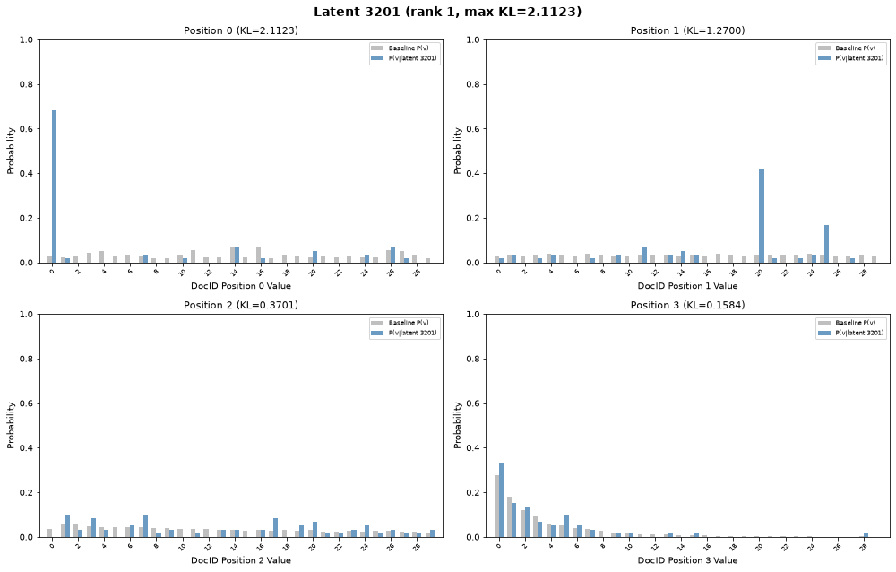

- **Position 0** (KL=2.1123):
  - top3: v0=0.683(基线0.032), v14=0.067(基线0.066), v26=0.067(基线0.054)
  - bottom3: v3=0.000(基线0.041), v2=0.000(基线0.032), v5=0.000(基线0.031)
- **Position 1** (KL=1.2700):
  - top3: v20=0.417(基线0.036), v25=0.167(基线0.034), v11=0.067(基线0.034)
  - bottom3: v2=0.000(基线0.029), v5=0.000(基线0.035), v6=0.000(基线0.029)
- **Position 2** (KL=0.3701):
  - top3: v1=0.100(基线0.054), v7=0.100(基线0.043), v3=0.083(基线0.048)
  - bottom3: v0=0.000(基线0.034), v5=0.000(基线0.044), v12=0.000(基线0.035)
- **Position 3** (KL=0.1584):
  - top3: v0=0.333(基线0.277), v1=0.150(基线0.179), v2=0.133(基线0.122)
  - bottom3: v12=0.000(基线0.011), v14=0.000(基线0.007), v11=0.000(基线0.012)

### Latent 4697（最佳位置: 0, KL=1.6463, 激活样本: 68）

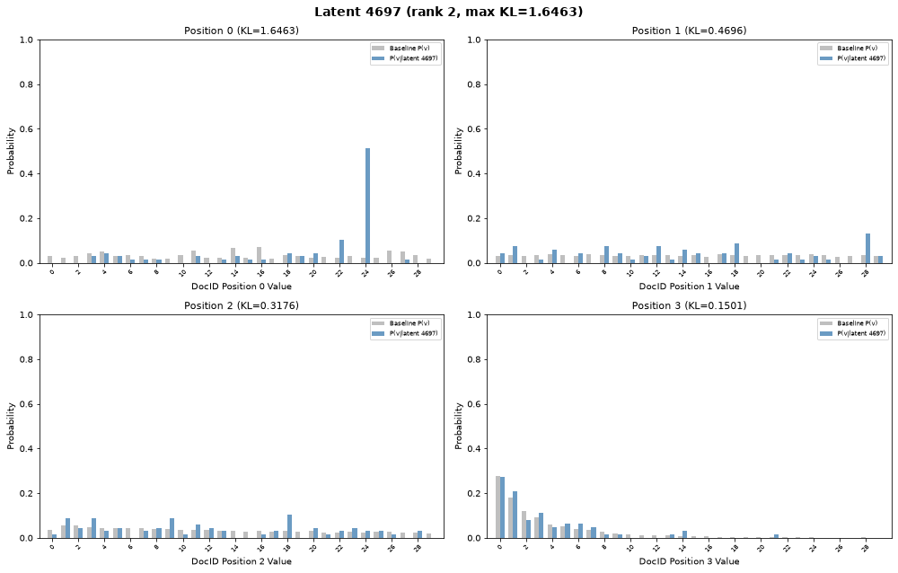

- **Position 0** (KL=1.6463):
  - top3: v24=0.515(基线0.023), v22=0.103(基线0.024), v4=0.044(基线0.053)
  - bottom3: v0=0.000(基线0.032), v1=0.000(基线0.024), v2=0.000(基线0.032)
- **Position 1** (KL=0.4696):
  - top3: v28=0.132(基线0.036), v18=0.088(基线0.036), v1=0.074(基线0.036)
  - bottom3: v2=0.000(基线0.029), v5=0.000(基线0.035), v7=0.000(基线0.037)
- **Position 2** (KL=0.3176):
  - top3: v18=0.103(基线0.030), v1=0.088(基线0.054), v9=0.088(基线0.041)
  - bottom3: v6=0.000(基线0.043), v14=0.000(基线0.031), v15=0.000(基线0.028)
- **Position 3** (KL=0.1501):
  - top3: v0=0.274(基线0.277), v1=0.210(基线0.179), v3=0.113(基线0.091)
  - bottom3: v12=0.000(基线0.011), v15=0.000(基线0.005), v10=0.000(基线0.016)

### Latent 6972（最佳位置: 0, KL=1.5541, 激活样本: 169）

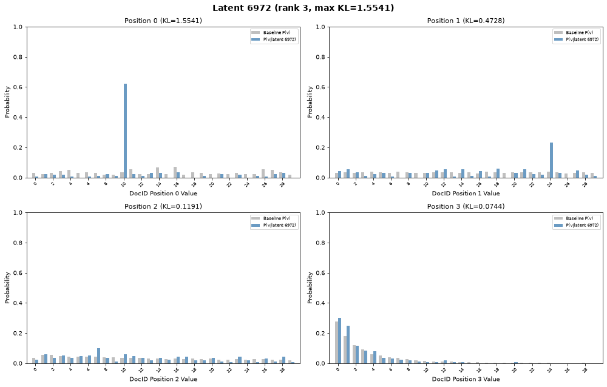

- **Position 0** (KL=1.5541):
  - top3: v10=0.621(基线0.037), v16=0.036(基线0.072), v14=0.030(基线0.066)
  - bottom3: v5=0.000(基线0.031), v15=0.000(基线0.021), v24=0.000(基线0.023)
- **Position 1** (KL=0.4728):
  - top3: v24=0.231(基线0.040), v18=0.059(基线0.036), v1=0.053(基线0.036)
  - bottom3: v7=0.000(基线0.037), v9=0.000(基线0.031), v26=0.000(基线0.025)
- **Position 2** (KL=0.1191):
  - top3: v7=0.101(基线0.043), v1=0.059(基线0.054), v10=0.059(基线0.036)
  - bottom3: v25=0.006(基线0.027), v29=0.006(基线0.020), v22=0.006(基线0.023)
- **Position 3** (KL=0.0744):
  - top3: v0=0.299(基线0.277), v1=0.250(基线0.179), v2=0.116(基线0.122)
  - bottom3: v15=0.000(基线0.005), v23=0.000(基线0.002), v22=0.000(基线0.003)

### Latent 853（最佳位置: 0, KL=1.4195, 激活样本: 58）

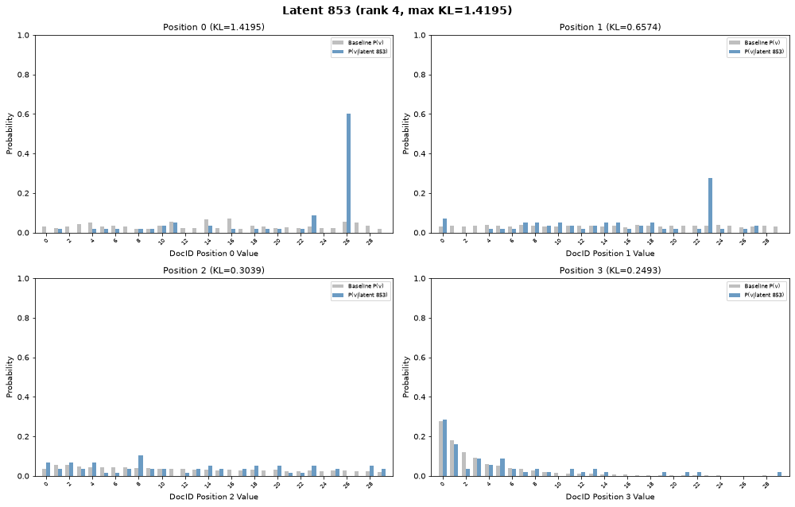

- **Position 0** (KL=1.4195):
  - top3: v26=0.603(基线0.054), v23=0.086(基线0.030), v11=0.052(基线0.055)
  - bottom3: v0=0.000(基线0.032), v2=0.000(基线0.032), v3=0.000(基线0.041)
- **Position 1** (KL=0.6574):
  - top3: v23=0.276(基线0.034), v0=0.069(基线0.031), v10=0.052(基线0.031)
  - bottom3: v1=0.000(基线0.036), v2=0.000(基线0.029), v3=0.000(基线0.033)
- **Position 2** (KL=0.3039):
  - top3: v8=0.103(基线0.041), v0=0.069(基线0.034), v4=0.069(基线0.044)
  - bottom3: v11=0.000(基线0.036), v26=0.000(基线0.026), v19=0.000(基线0.026)
- **Position 3** (KL=0.2493):
  - top3: v0=0.286(基线0.277), v1=0.161(基线0.179), v3=0.089(基线0.091)
  - bottom3: v15=0.000(基线0.005), v10=0.000(基线0.016), v26=0.000(基线0.001)

### Latent 6420（最佳位置: 0, KL=1.4068, 激活样本: 265）

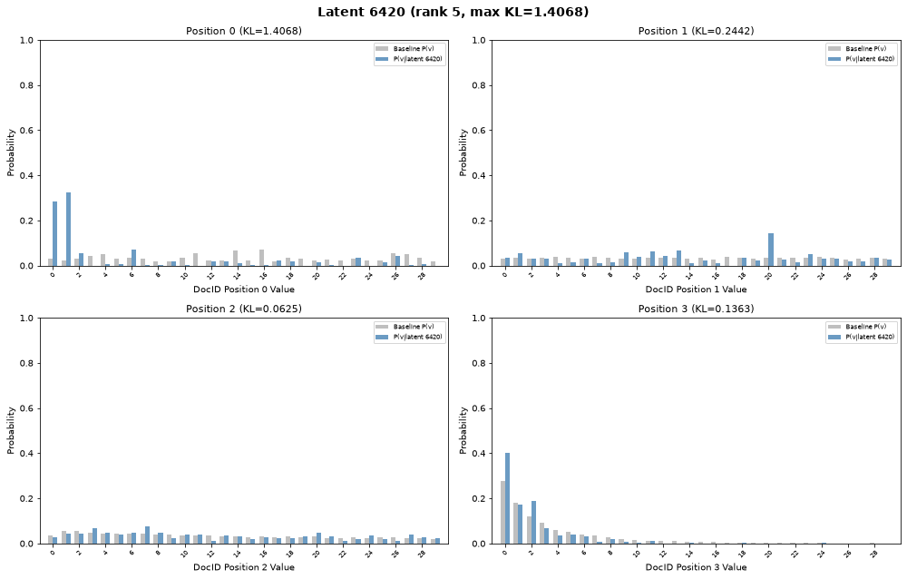

- **Position 0** (KL=1.4068):
  - top3: v1=0.325(基线0.024), v0=0.283(基线0.032), v6=0.072(基线0.033)
  - bottom3: v3=0.000(基线0.041), v11=0.000(基线0.055), v22=0.000(基线0.024)
- **Position 1** (KL=0.2442):
  - top3: v20=0.143(基线0.036), v13=0.068(基线0.036), v11=0.064(基线0.034)
  - bottom3: v17=0.000(基线0.040), v7=0.011(基线0.037), v14=0.011(基线0.031)
- **Position 2** (KL=0.0625):
  - top3: v7=0.075(基线0.043), v3=0.068(基线0.048), v4=0.049(基线0.044)
  - bottom3: v12=0.011(基线0.035), v22=0.011(基线0.023), v26=0.011(基线0.026)
- **Position 3** (KL=0.1363):
  - top3: v0=0.402(基线0.277), v2=0.187(基线0.122), v1=0.171(基线0.179)
  - bottom3: v15=0.000(基线0.005), v12=0.000(基线0.011), v13=0.000(基线0.010)

### Latent 6358（最佳位置: 0, KL=1.4035, 激活样本: 72）

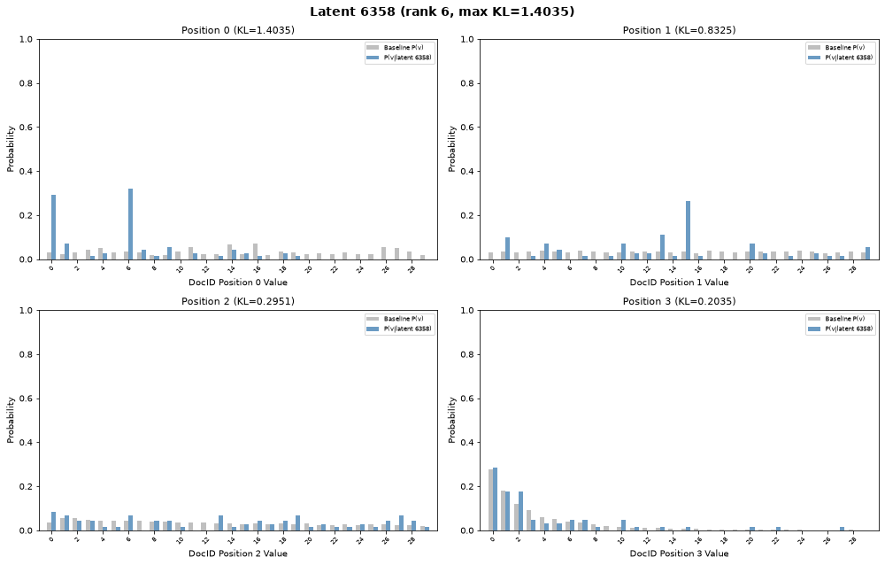

- **Position 0** (KL=1.4035):
  - top3: v6=0.319(基线0.033), v0=0.292(基线0.032), v1=0.069(基线0.024)
  - bottom3: v2=0.000(基线0.032), v5=0.000(基线0.031), v12=0.000(基线0.023)
- **Position 1** (KL=0.8325):
  - top3: v15=0.264(基线0.035), v13=0.111(基线0.036), v1=0.097(基线0.036)
  - bottom3: v0=0.000(基线0.031), v2=0.000(基线0.029), v6=0.000(基线0.029)
- **Position 2** (KL=0.2951):
  - top3: v0=0.083(基线0.034), v1=0.069(基线0.054), v6=0.069(基线0.043)
  - bottom3: v7=0.000(基线0.043), v11=0.000(基线0.036), v12=0.000(基线0.035)
- **Position 3** (KL=0.2035):
  - top3: v0=0.286(基线0.277), v1=0.175(基线0.179), v2=0.175(基线0.122)
  - bottom3: v12=0.000(基线0.011), v14=0.000(基线0.007), v9=0.000(基线0.020)

### Latent 3155（最佳位置: 0, KL=1.3950, 激活样本: 162）

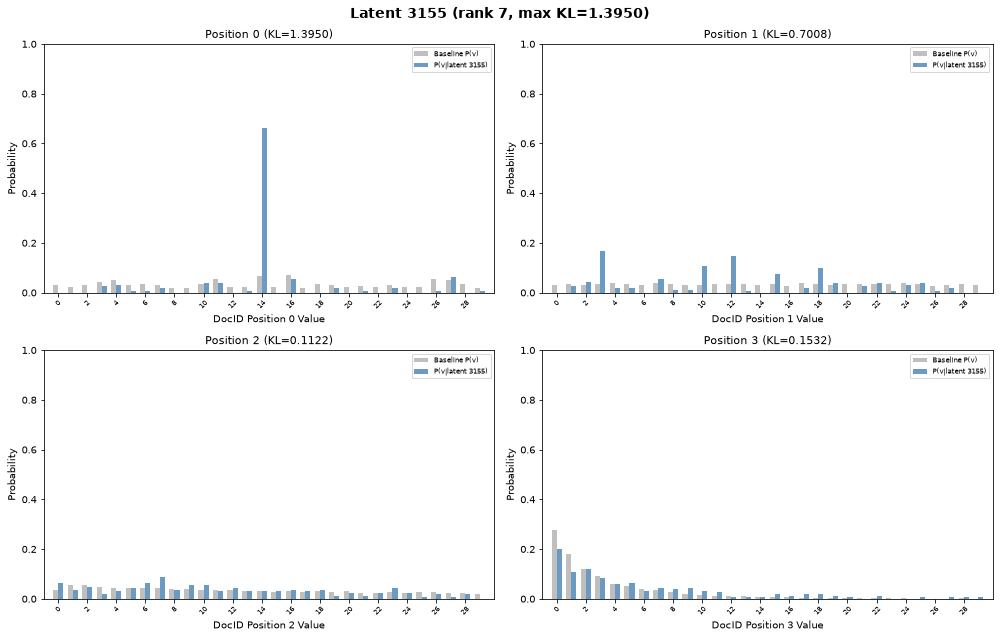

- **Position 0** (KL=1.3950):
  - top3: v14=0.660(基线0.066), v27=0.062(基线0.051), v16=0.056(基线0.072)
  - bottom3: v0=0.000(基线0.032), v1=0.000(基线0.024), v2=0.000(基线0.032)
- **Position 1** (KL=0.7008):
  - top3: v3=0.167(基线0.033), v12=0.148(基线0.034), v10=0.105(基线0.031)
  - bottom3: v0=0.000(基线0.031), v6=0.000(基线0.029), v14=0.000(基线0.031)
- **Position 2** (KL=0.1122):
  - top3: v7=0.086(基线0.043), v0=0.062(基线0.034), v6=0.062(基线0.043)
  - bottom3: v29=0.000(基线0.020), v25=0.006(基线0.027), v27=0.006(基线0.023)
- **Position 3** (KL=0.1532):
  - top3: v0=0.199(基线0.277), v2=0.122(基线0.122), v1=0.109(基线0.179)
  - bottom3: v24=0.000(基线0.001), v26=0.000(基线0.001), v21=0.000(基线0.002)

### Latent 3634（最佳位置: 1, KL=1.3536, 激活样本: 110）

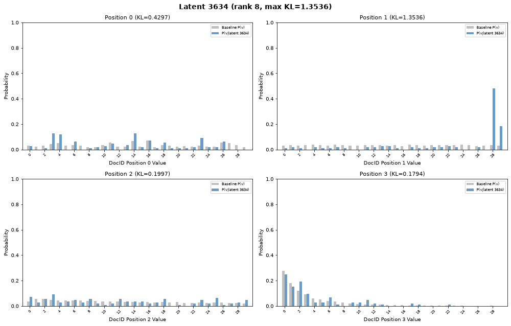

- **Position 0** (KL=0.4297):
  - top3: v3=0.127(基线0.041), v14=0.127(基线0.066), v4=0.118(基线0.053)
  - bottom3: v1=0.000(基线0.024), v5=0.000(基线0.031), v7=0.000(基线0.030)
- **Position 1** (KL=1.3536):
  - top3: v28=0.482(基线0.036), v29=0.182(基线0.030), v13=0.027(基线0.036)
  - bottom3: v3=0.000(基线0.033), v9=0.000(基线0.031), v10=0.000(基线0.031)
- **Position 2** (KL=0.1997):
  - top3: v3=0.091(基线0.048), v0=0.073(基线0.034), v25=0.064(基线0.027)
  - bottom3: v21=0.000(基线0.023), v19=0.000(基线0.026), v10=0.009(基线0.036)
- **Position 3** (KL=0.1794):
  - top3: v0=0.250(基线0.277), v2=0.192(基线0.122), v1=0.154(基线0.179)
  - bottom3: v15=0.000(基线0.005), v14=0.000(基线0.007), v8=0.000(基线0.029)

### Latent 2474（最佳位置: 0, KL=1.2713, 激活样本: 261）

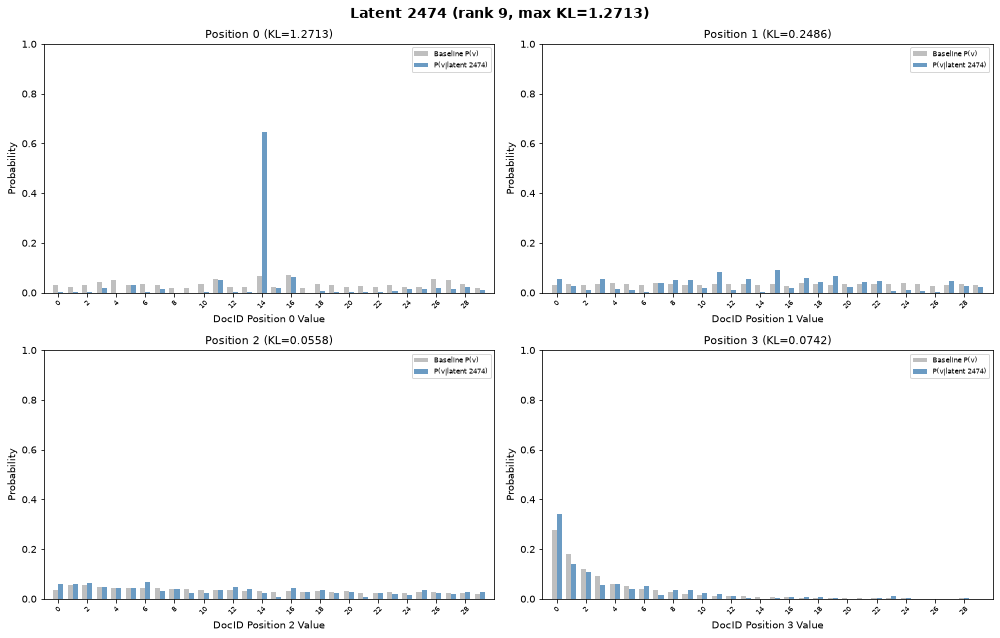

- **Position 0** (KL=1.2713):
  - top3: v14=0.648(基线0.066), v16=0.061(基线0.072), v11=0.050(基线0.055)
  - bottom3: v4=0.000(基线0.053), v8=0.000(基线0.019), v9=0.000(基线0.020)
- **Position 1** (KL=0.2486):
  - top3: v15=0.092(基线0.035), v11=0.084(基线0.034), v19=0.065(基线0.029)
  - bottom3: v6=0.004(基线0.029), v14=0.004(基线0.031), v26=0.004(基线0.025)
- **Position 2** (KL=0.0558):
  - top3: v6=0.069(基线0.043), v2=0.065(基线0.054), v1=0.061(基线0.054)
  - bottom3: v15=0.008(基线0.028), v21=0.008(基线0.023), v24=0.015(基线0.022)
- **Position 3** (KL=0.0742):
  - top3: v0=0.343(基线0.277), v1=0.139(基线0.179), v2=0.108(基线0.122)
  - bottom3: v14=0.000(基线0.007), v26=0.000(基线0.001), v27=0.000(基线0.001)

### Latent 3674（最佳位置: 0, KL=1.2625, 激活样本: 226）

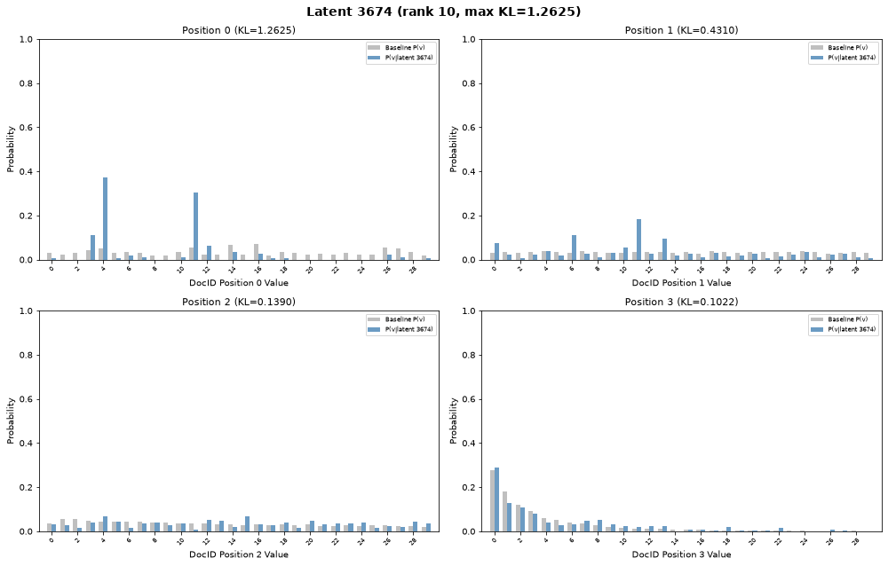

- **Position 0** (KL=1.2625):
  - top3: v4=0.372(基线0.053), v11=0.305(基线0.055), v3=0.111(基线0.041)
  - bottom3: v1=0.000(基线0.024), v2=0.000(基线0.032), v9=0.000(基线0.020)
- **Position 1** (KL=0.4310):
  - top3: v11=0.181(基线0.034), v6=0.111(基线0.029), v13=0.093(基线0.036)
  - bottom3: v2=0.004(基线0.029), v21=0.004(基线0.034), v29=0.004(基线0.030)
- **Position 2** (KL=0.1390):
  - top3: v4=0.066(基线0.044), v15=0.066(基线0.028), v12=0.053(基线0.035)
  - bottom3: v11=0.009(基线0.036), v2=0.013(基线0.054), v6=0.013(基线0.043)
- **Position 3** (KL=0.1022):
  - top3: v0=0.288(基线0.277), v1=0.128(基线0.179), v2=0.110(基线0.122)
  - bottom3: v14=0.000(基线0.007), v25=0.000(基线0.001), v29=0.000(基线0.000)

### Latent 3336（最佳位置: 0, KL=1.2603, 激活样本: 68）

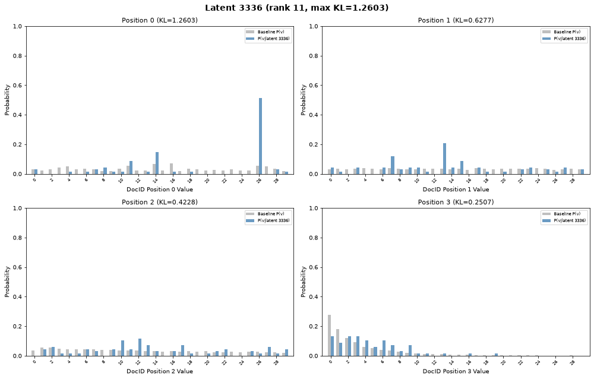

- **Position 0** (KL=1.2603):
  - top3: v26=0.515(基线0.054), v14=0.147(基线0.066), v11=0.088(基线0.055)
  - bottom3: v1=0.000(基线0.024), v2=0.000(基线0.032), v3=0.000(基线0.041)
- **Position 1** (KL=0.6277):
  - top3: v13=0.206(基线0.036), v7=0.118(基线0.037), v15=0.088(基线0.035)
  - bottom3: v2=0.000(基线0.029), v4=0.000(基线0.037), v5=0.000(基线0.035)
- **Position 2** (KL=0.4228):
  - top3: v12=0.118(基线0.035), v10=0.103(基线0.036), v13=0.074(基线0.033)
  - bottom3: v0=0.000(基线0.034), v8=0.000(基线0.041), v15=0.000(基线0.028)
- **Position 3** (KL=0.2507):
  - top3: v0=0.132(基线0.277), v2=0.132(基线0.122), v3=0.132(基线0.091)
  - bottom3: v15=0.000(基线0.005), v12=0.000(基线0.011), v14=0.000(基线0.007)

### Latent 4165（最佳位置: 0, KL=1.2541, 激活样本: 65）

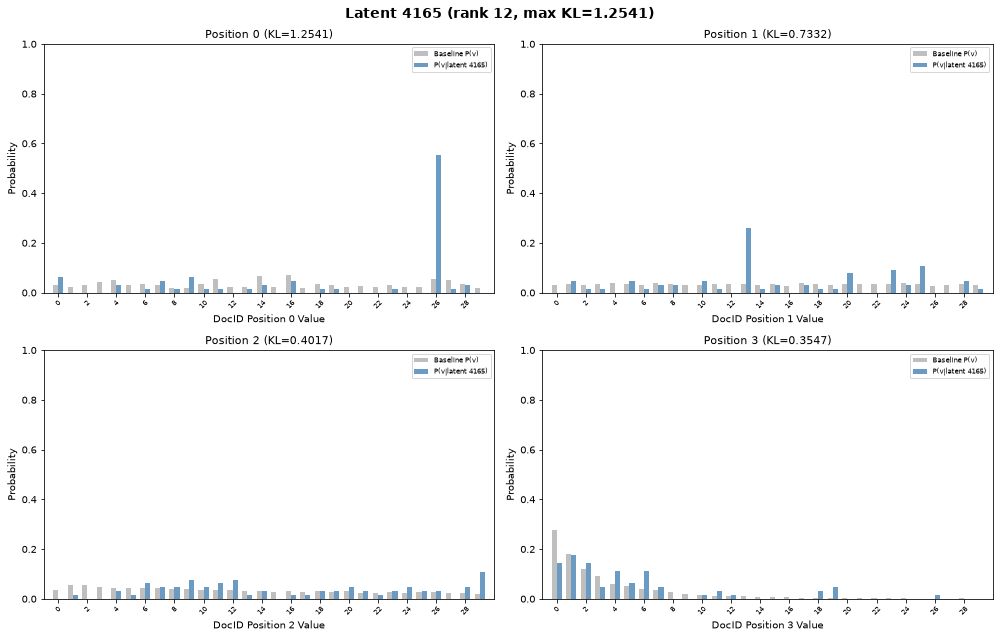

- **Position 0** (KL=1.2541):
  - top3: v26=0.554(基线0.054), v0=0.062(基线0.032), v9=0.062(基线0.020)
  - bottom3: v1=0.000(基线0.024), v2=0.000(基线0.032), v3=0.000(基线0.041)
- **Position 1** (KL=0.7332):
  - top3: v13=0.262(基线0.036), v25=0.108(基线0.034), v23=0.092(基线0.034)
  - bottom3: v0=0.000(基线0.031), v4=0.000(基线0.037), v12=0.000(基线0.034)
- **Position 2** (KL=0.4017):
  - top3: v29=0.108(基线0.020), v12=0.077(基线0.035), v9=0.077(基线0.041)
  - bottom3: v0=0.000(基线0.034), v2=0.000(基线0.054), v3=0.000(基线0.048)
- **Position 3** (KL=0.3547):
  - top3: v1=0.175(基线0.179), v0=0.143(基线0.277), v2=0.143(基线0.122)
  - bottom3: v13=0.000(基线0.010), v14=0.000(基线0.007), v9=0.000(基线0.020)

### Latent 3407（最佳位置: 0, KL=1.2385, 激活样本: 311）

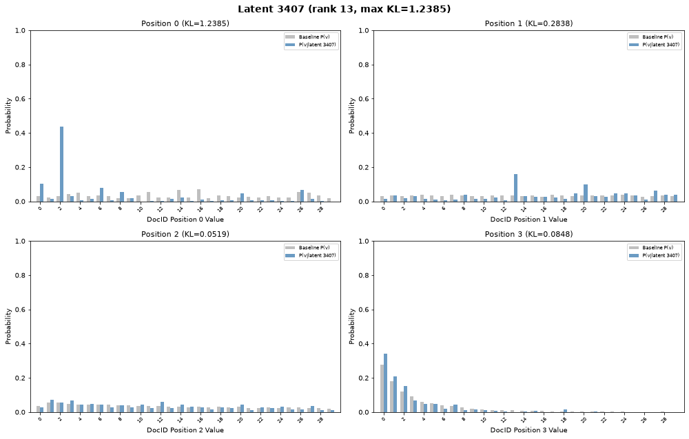

- **Position 0** (KL=1.2385):
  - top3: v2=0.437(基线0.032), v0=0.103(基线0.032), v6=0.077(基线0.033)
  - bottom3: v10=0.000(基线0.037), v29=0.000(基线0.019), v11=0.003(基线0.055)
- **Position 1** (KL=0.2838):
  - top3: v13=0.161(基线0.036), v20=0.100(基线0.036), v27=0.064(基线0.032)
  - bottom3: v6=0.006(基线0.029), v12=0.006(基线0.034), v7=0.010(基线0.037)
- **Position 2** (KL=0.0519):
  - top3: v1=0.071(基线0.054), v3=0.068(基线0.048), v12=0.061(基线0.035)
  - bottom3: v29=0.013(基线0.020), v28=0.013(基线0.022), v21=0.013(基线0.023)
- **Position 3** (KL=0.0848):
  - top3: v0=0.343(基线0.277), v1=0.210(基线0.179), v2=0.150(基线0.122)
  - bottom3: v13=0.000(基线0.010), v25=0.000(基线0.001), v22=0.000(基线0.003)

### Latent 1991（最佳位置: 0, KL=1.2377, 激活样本: 78）

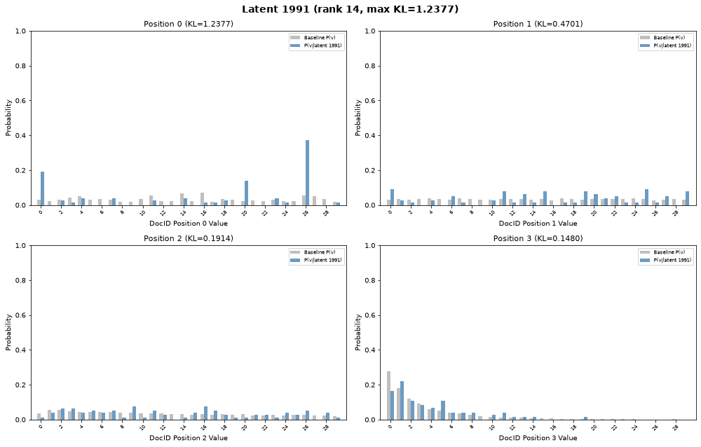

- **Position 0** (KL=1.2377):
  - top3: v26=0.372(基线0.054), v0=0.192(基线0.032), v20=0.141(基线0.021)
  - bottom3: v1=0.000(基线0.024), v5=0.000(基线0.031), v6=0.000(基线0.033)
- **Position 1** (KL=0.4701):
  - top3: v0=0.090(基线0.031), v25=0.090(基线0.034), v15=0.077(基线0.035)
  - bottom3: v3=0.000(基线0.033), v5=0.000(基线0.035), v9=0.000(基线0.031)
- **Position 2** (KL=0.1914):
  - top3: v9=0.077(基线0.041), v16=0.077(基线0.030), v2=0.064(基线0.054)
  - bottom3: v13=0.000(基线0.033), v27=0.000(基线0.023), v8=0.013(基线0.041)
- **Position 3** (KL=0.1480):
  - top3: v1=0.219(基线0.179), v0=0.164(基线0.277), v2=0.110(基线0.122)
  - bottom3: v15=0.000(基线0.005), v9=0.000(基线0.020), v21=0.000(基线0.002)

### Latent 7760（最佳位置: 0, KL=1.2229, 激活样本: 286）

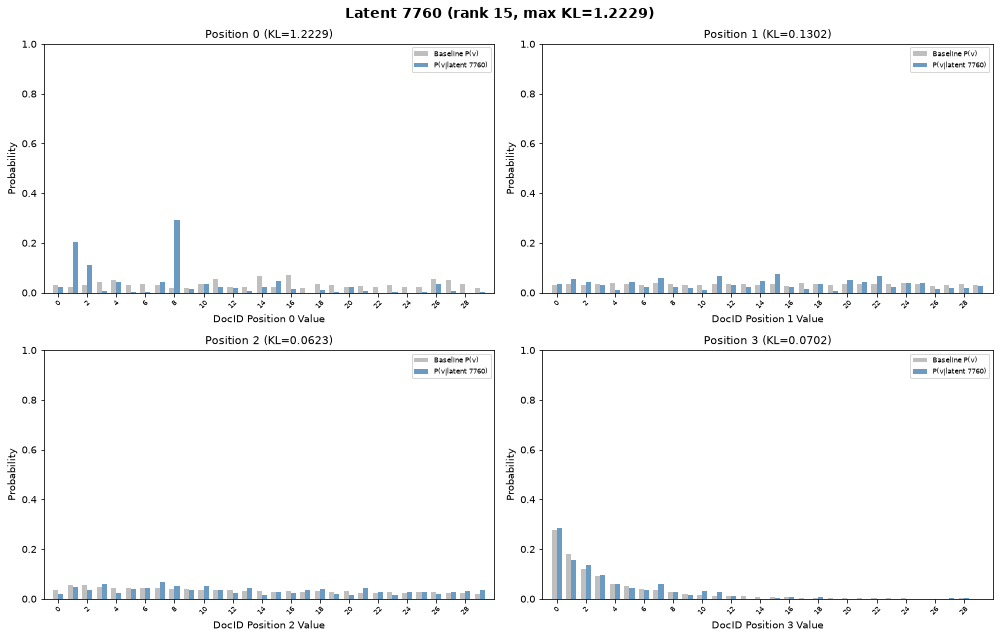

- **Position 0** (KL=1.2229):
  - top3: v8=0.294(基线0.019), v1=0.203(基线0.024), v2=0.112(基线0.032)
  - bottom3: v24=0.000(基线0.023), v28=0.000(基线0.035), v22=0.000(基线0.024)
- **Position 1** (KL=0.1302):
  - top3: v15=0.073(基线0.035), v11=0.066(基线0.034), v22=0.066(基线0.036)
  - bottom3: v19=0.007(基线0.029), v4=0.010(基线0.037), v10=0.010(基线0.031)
- **Position 2** (KL=0.0623):
  - top3: v7=0.066(基线0.043), v3=0.059(基线0.048), v10=0.052(基线0.036)
  - bottom3: v14=0.014(基线0.031), v23=0.014(基线0.027), v20=0.014(基线0.030)
- **Position 3** (KL=0.0702):
  - top3: v0=0.283(基线0.277), v1=0.155(基线0.179), v2=0.136(基线0.122)
  - bottom3: v13=0.000(基线0.010), v14=0.000(基线0.007), v23=0.000(基线0.002)

### Latent 1264（最佳位置: 0, KL=1.2112, 激活样本: 257）

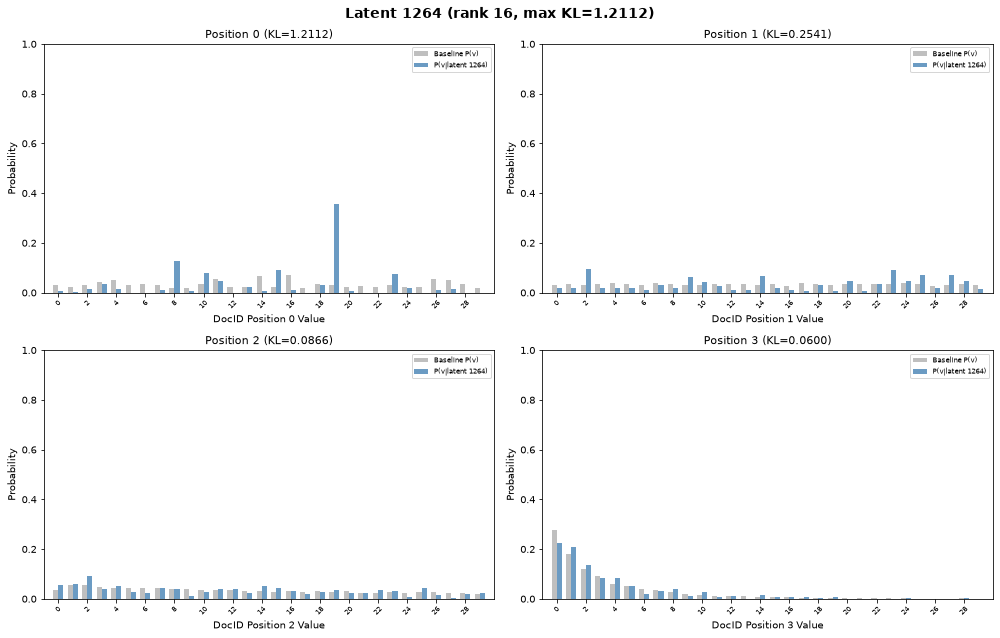

- **Position 0** (KL=1.2112):
  - top3: v19=0.358(基线0.031), v8=0.128(基线0.019), v15=0.089(基线0.021)
  - bottom3: v6=0.000(基线0.033), v5=0.000(基线0.031), v12=0.000(基线0.023)
- **Position 1** (KL=0.2541):
  - top3: v2=0.093(基线0.029), v23=0.089(基线0.034), v25=0.070(基线0.034)
  - bottom3: v19=0.008(基线0.029), v21=0.008(基线0.034), v17=0.008(基线0.040)
- **Position 2** (KL=0.0866):
  - top3: v2=0.093(基线0.054), v1=0.058(基线0.054), v0=0.054(基线0.034)
  - bottom3: v27=0.004(基线0.023), v24=0.008(基线0.022), v9=0.012(基线0.041)
- **Position 3** (KL=0.0600):
  - top3: v0=0.224(基线0.277), v1=0.208(基线0.179), v2=0.135(基线0.122)
  - bottom3: v13=0.000(基线0.010), v26=0.000(基线0.001), v27=0.000(基线0.001)

### Latent 3872（最佳位置: 0, KL=1.1846, 激活样本: 330）

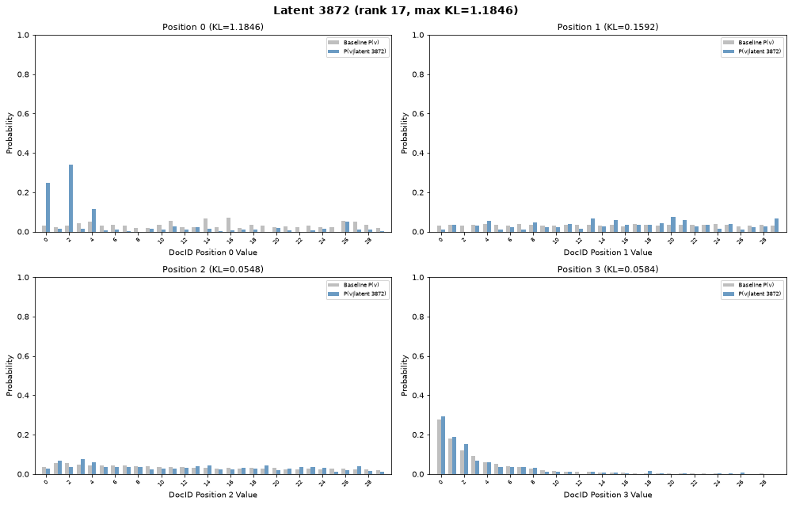

- **Position 0** (KL=1.1846):
  - top3: v2=0.339(基线0.032), v0=0.248(基线0.032), v4=0.115(基线0.053)
  - bottom3: v8=0.000(基线0.019), v25=0.000(基线0.022), v22=0.000(基线0.024)
- **Position 1** (KL=0.1592):
  - top3: v20=0.076(基线0.036), v13=0.067(基线0.036), v29=0.067(基线0.030)
  - bottom3: v2=0.000(基线0.029), v0=0.009(基线0.031), v26=0.009(基线0.025)
- **Position 2** (KL=0.0548):
  - top3: v3=0.076(基线0.048), v1=0.067(基线0.054), v4=0.061(基线0.044)
  - bottom3: v25=0.012(基线0.027), v29=0.012(基线0.020), v28=0.015(基线0.022)
- **Position 3** (KL=0.0584):
  - top3: v0=0.293(基线0.277), v1=0.190(基线0.179), v2=0.151(基线0.122)
  - bottom3: v12=0.000(基线0.011), v27=0.000(基线0.001), v29=0.000(基线0.000)

### Latent 3548（最佳位置: 0, KL=1.1781, 激活样本: 75）

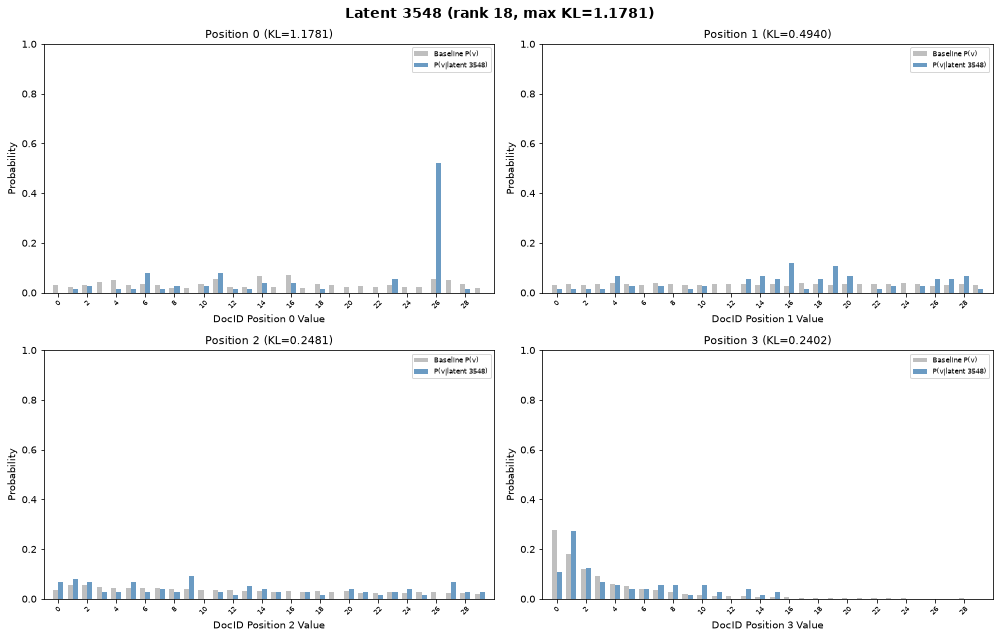

- **Position 0** (KL=1.1781):
  - top3: v26=0.520(基线0.054), v6=0.080(基线0.033), v11=0.080(基线0.055)
  - bottom3: v0=0.000(基线0.032), v3=0.000(基线0.041), v15=0.000(基线0.021)
- **Position 1** (KL=0.4940):
  - top3: v16=0.120(基线0.027), v19=0.107(基线0.029), v4=0.067(基线0.037)
  - bottom3: v6=0.000(基线0.029), v12=0.000(基线0.034), v11=0.000(基线0.034)
- **Position 2** (KL=0.2481):
  - top3: v9=0.093(基线0.041), v1=0.080(基线0.054), v2=0.067(基线0.054)
  - bottom3: v10=0.000(基线0.036), v26=0.000(基线0.026), v19=0.000(基线0.026)
- **Position 3** (KL=0.2402):
  - top3: v1=0.274(基线0.179), v2=0.123(基线0.122), v0=0.110(基线0.277)
  - bottom3: v12=0.000(基线0.011), v22=0.000(基线0.003), v29=0.000(基线0.000)

### Latent 1477（最佳位置: 0, KL=1.1723, 激活样本: 71）

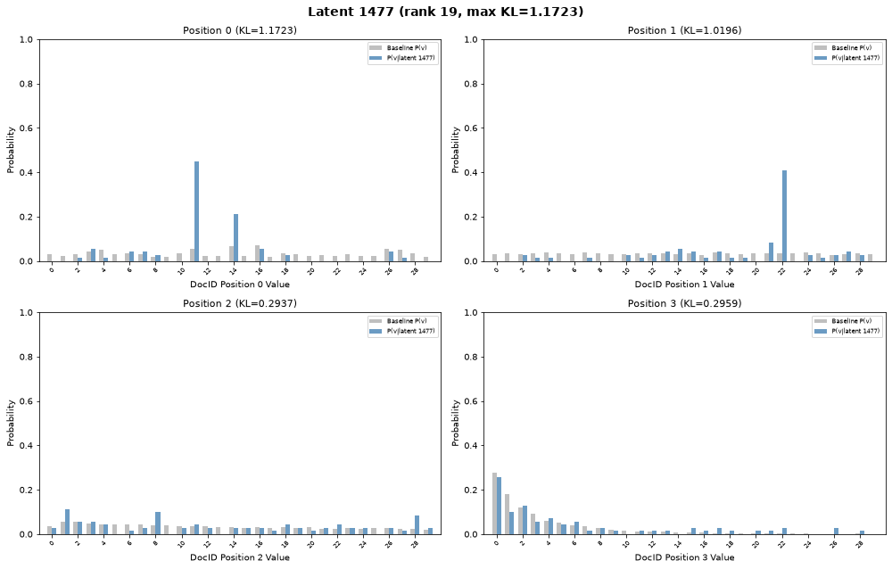

- **Position 0** (KL=1.1723):
  - top3: v11=0.451(基线0.055), v14=0.211(基线0.066), v3=0.056(基线0.041)
  - bottom3: v0=0.000(基线0.032), v1=0.000(基线0.024), v5=0.000(基线0.031)
- **Position 1** (KL=1.0196):
  - top3: v22=0.408(基线0.036), v21=0.085(基线0.034), v14=0.056(基线0.031)
  - bottom3: v0=0.000(基线0.031), v1=0.000(基线0.036), v6=0.000(基线0.029)
- **Position 2** (KL=0.2937):
  - top3: v1=0.113(基线0.054), v8=0.099(基线0.041), v28=0.085(基线0.022)
  - bottom3: v5=0.000(基线0.044), v9=0.000(基线0.041), v13=0.000(基线0.033)
- **Position 3** (KL=0.2959):
  - top3: v0=0.257(基线0.277), v2=0.129(基线0.122), v1=0.100(基线0.179)
  - bottom3: v14=0.000(基线0.007), v10=0.000(基线0.016), v27=0.000(基线0.001)

### Latent 6004（最佳位置: 0, KL=1.1690, 激活样本: 271）

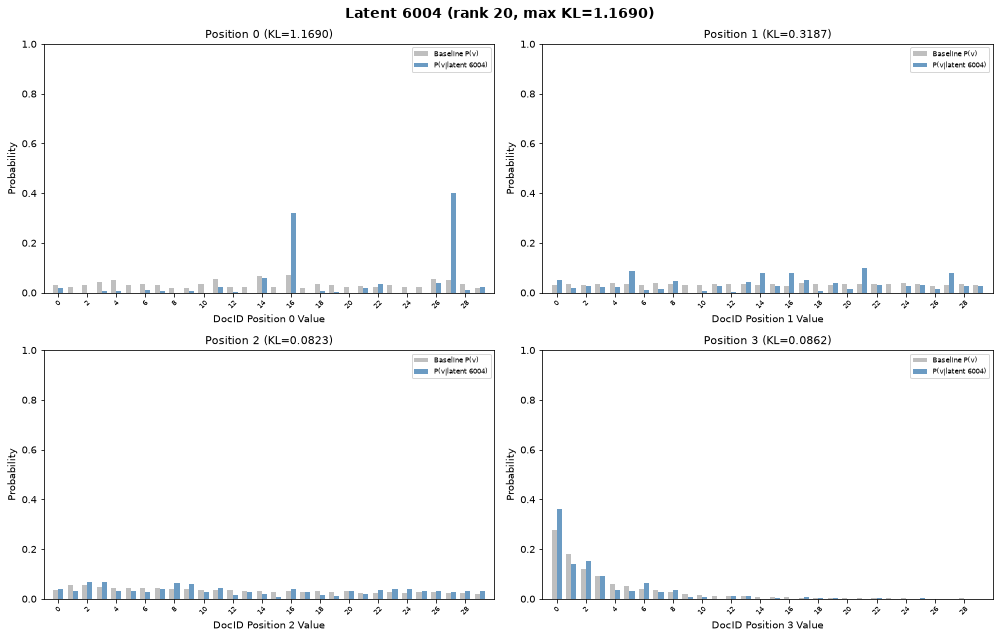

- **Position 0** (KL=1.1690):
  - top3: v27=0.402(基线0.051), v16=0.321(基线0.072), v14=0.059(基线0.066)
  - bottom3: v1=0.000(基线0.024), v2=0.000(基线0.032), v5=0.000(基线0.031)
- **Position 1** (KL=0.3187):
  - top3: v21=0.100(基线0.034), v5=0.085(基线0.035), v16=0.077(基线0.027)
  - bottom3: v9=0.000(基线0.031), v23=0.000(基线0.034), v12=0.004(基线0.034)
- **Position 2** (KL=0.0823):
  - top3: v3=0.066(基线0.048), v2=0.066(基线0.054), v8=0.063(基线0.041)
  - bottom3: v15=0.007(基线0.028), v19=0.011(基线0.026), v18=0.015(基线0.030)
- **Position 3** (KL=0.0862):
  - top3: v0=0.360(基线0.277), v2=0.150(基线0.122), v1=0.138(基线0.179)
  - bottom3: v14=0.000(基线0.007), v11=0.000(基线0.012), v27=0.000(基线0.001)

## 已知 Prefix Routing Features 验证

### Feature 2125（激活样本: 494）

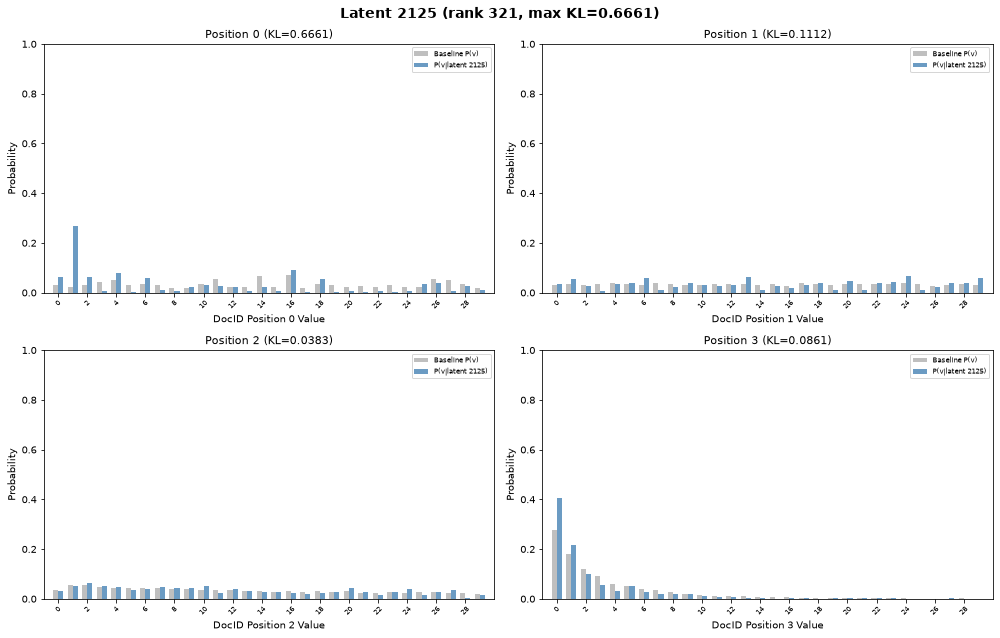

**Position 0 条件概率** (KL=0.6661):

| Value | P(v|active) | P(v) 基线 | 倍率 |
|-------|------------|----------|------|
| 1 | 0.269 | 0.024 | 11.2x |
| 16 | 0.089 | 0.072 | 1.2x |
| 4 | 0.077 | 0.053 | 1.5x |
| 2 | 0.063 | 0.032 | 2.0x |
| 0 | 0.061 | 0.032 | 1.9x |

### Feature 7760（激活样本: 286）

**Position 0 条件概率** (KL=1.2229):

| Value | P(v|active) | P(v) 基线 | 倍率 |
|-------|------------|----------|------|
| 8 | 0.294 | 0.019 | 15.6x |
| 1 | 0.203 | 0.024 | 8.4x |
| 2 | 0.112 | 0.032 | 3.5x |
| 15 | 0.045 | 0.021 | 2.2x |
| 7 | 0.042 | 0.030 | 1.4x |

### Feature 2236（激活样本: 283）

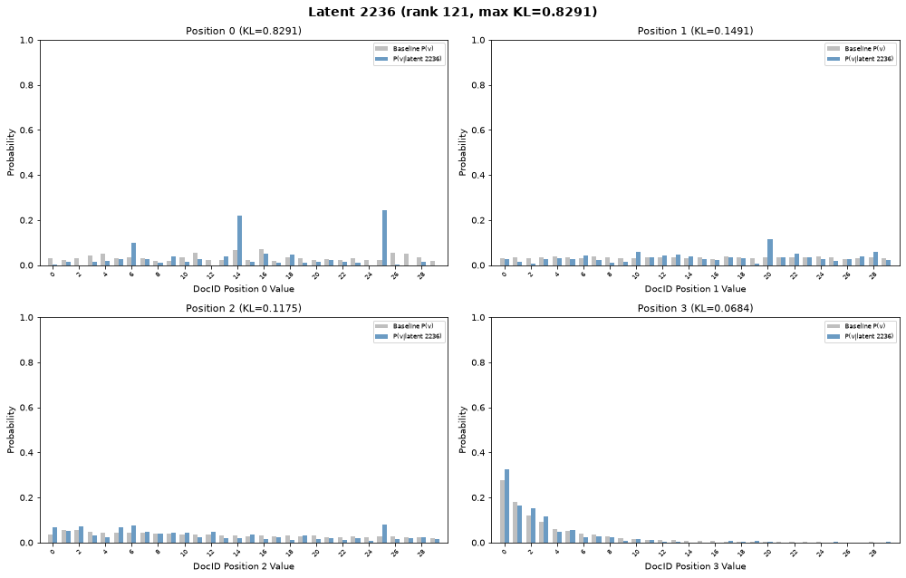

**Position 0 条件概率** (KL=0.8291):

| Value | P(v|active) | P(v) 基线 | 倍率 |
|-------|------------|----------|------|
| 25 | 0.244 | 0.022 | 11.0x |
| 14 | 0.219 | 0.066 | 3.3x |
| 6 | 0.099 | 0.033 | 3.0x |
| 16 | 0.049 | 0.072 | 0.7x |
| 18 | 0.046 | 0.035 | 1.3x |

### Feature 6972（激活样本: 169）

**Position 0 条件概率** (KL=1.5541):

| Value | P(v|active) | P(v) 基线 | 倍率 |
|-------|------------|----------|------|
| 10 | 0.621 | 0.037 | 17.0x |
| 16 | 0.036 | 0.072 | 0.5x |
| 14 | 0.030 | 0.066 | 0.5x |
| 13 | 0.030 | 0.022 | 1.3x |
| 28 | 0.030 | 0.035 | 0.8x |
